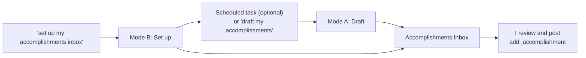

# accomplishments-inbox skill

A Claude skill for my career accomplishments workflow. It drafts accomplishments
from my GitHub activity into a private **Accomplishments Inbox** artifact. I
review the drafts there and post them to my public AT Protocol repo, which my
portfolio at https://jlawcordova.com shows.

| File | What it is |
| --- | --- |
| [`SKILL.md`](SKILL.md) | The skill's instructions. |
| [`assets/accomplishments-inbox.html`](assets/accomplishments-inbox.html) | The inbox page the skill publishes as an artifact. |

## When it's used

The skill has two modes, and Claude picks one from the request:

- **Mode A: Draft.** A scheduled task invokes it, or I ask "draft my
  accomplishments". It reviews my last 7 days on GitHub, skips work that's
  already posted or drafted, writes 3 to 5 public-safe drafts to the inbox,
  and notifies me. It never posts anything itself.
- **Mode B: Set up or repair.** I ask "set up my accomplishments inbox" or
  "fix my accomplishments inbox". It reuses or publishes the inbox artifact,
  and creates or updates the weekly task unless I say not to.



## Install

You need these connectors in claude.ai:

- **GitHub**, to read my activity.
- **jlawcordova AT Proto** (the [`jlawcordova-mcp`](../../../jlawcordova-mcp)
  server), for `list_accomplishments`, `add_accomplishment`, and
  `delete_accomplishment`.

Then install the skill where it'll run:

- **Claude Code:** nothing to do. Sessions on this repo load skills from
  `.claude/skills/` automatically.
- **claude.ai** (needed for scheduled tasks, which run there):
  1. Optional: in `SKILL.md`, replace `<INBOX_URL>` with my inbox's URL once
     I have one. If I leave it, the skill finds the inbox by its title.
  2. Zip the folder from the repo root:

     ```sh
     cd .claude/skills && zip -r accomplishments-inbox.zip accomplishments-inbox
     ```

  3. Upload `accomplishments-inbox.zip` as a custom skill in claude.ai
     settings. If an older version is installed, replace it.

After changing anything in this folder, upload it to claude.ai again so
claude.ai uses the new version.

## Set up the inbox

Only needed the first time, or if the inbox goes missing. In claude.ai, ask
Claude "set up my accomplishments inbox". Mode B reuses my "Accomplishments
Inbox" artifact, or publishes a new one from
`assets/accomplishments-inbox.html`, and gives me its URL. It doesn't post
anything during setup.

## Run it weekly (optional)

A scheduled task can use the skill if I want drafts to arrive on their own.
During setup, Mode B also creates one named **Weekly accomplishments draft**
that runs every Monday at 8:50 AM Manila time
(`CRON_TZ=Asia/Manila 50 8 * * 1`), or updates it if it already exists. If I
don't want it, I tell Claude to skip it. To create one myself, any schedule
works.
Its prompt only needs to name the skill and the inbox, for example:

```text
Use the accomplishments-inbox skill in Mode A (Draft) to draft this week's
accomplishments into my Accomplishments Inbox: <INBOX_URL>. If the skill
isn't available, send me a push notification saying the weekly
accomplishments run couldn't find the accomplishments-inbox skill, and stop.
```

Everything else (what to gather, the description style, the public-safety
rules, and when to notify me) lives in `SKILL.md`, so the prompt doesn't
change when the skill does.
