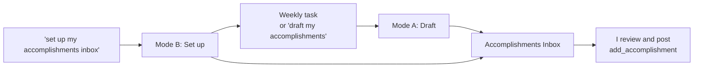

# accomplishments-inbox skill

A Claude skill for my career accomplishments workflow. It drafts accomplishments
from my GitHub activity into a private **Accomplishments Inbox** artifact. I
review the drafts there and post them to my public AT Protocol repo, which my
portfolio at https://jlawcordova.com shows.

| File | What it is |
| --- | --- |
| [`SKILL.md`](SKILL.md) | The skill's instructions. |
| [`assets/accomplishments-inbox.html`](assets/accomplishments-inbox.html) | The inbox page the skill publishes as an artifact. |

## When it's used

The skill has two modes, and Claude picks one from the request:

- **Mode A: Draft.** The weekly scheduled task invokes it, or I ask "draft my
  accomplishments". It reviews my last 7 days on GitHub, skips work that's
  already posted or drafted, writes 3 to 5 public-safe drafts to the inbox,
  and notifies me. It never posts anything itself.
- **Mode B: Set up or repair.** I ask "set up my accomplishments inbox" or
  "fix my accomplishments inbox". It reuses or publishes the inbox artifact
  and creates or updates the weekly task.



## Install

You need these connectors in claude.ai:

- **GitHub**, to read my activity.
- **jlawcordova AT Proto** (the [`jlawcordova-mcp`](../../../jlawcordova-mcp)
  server), for `list_accomplishments`, `add_accomplishment`, and
  `delete_accomplishment`.

Then install the skill where it'll run:

- **Claude Code:** nothing to do. Sessions on this repo load skills from
  `.claude/skills/` automatically.
- **claude.ai** (needed for the weekly task, which runs there):
  1. Optional: in `SKILL.md`, replace `<INBOX_URL>` with my inbox's URL once
     I have one. If I leave it, the skill finds the inbox by its title.
  2. Zip the folder from the repo root:

     ```sh
     cd .claude/skills && zip -r accomplishments-inbox.zip accomplishments-inbox
     ```

  3. Upload `accomplishments-inbox.zip` as a custom skill in claude.ai
     settings. If an older version is installed, replace it.

After changing anything in this folder, upload it to claude.ai again so the
weekly task runs the new version.

## Set up the inbox and weekly task

Only needed the first time, or if the inbox or task goes missing.

**The easy way:** in claude.ai, ask Claude "set up my accomplishments inbox".
Mode B then:

1. Reuses my "Accomplishments Inbox" artifact, or publishes a new one from
   `assets/accomplishments-inbox.html`, and gives me its URL.
2. Creates the **Weekly accomplishments draft** task, or updates it if it
   already exists. It runs every Monday at 8:50 AM Manila time
   (`CRON_TZ=Asia/Manila 50 8 * * 1`) and doesn't need my computer.
3. Tells me the task's next run time and whether its runs need my approval.

It doesn't run the task or post anything during setup.

**By hand:** create a scheduled task in claude.ai with the name and schedule
above, and paste the prompt from
[`docs/weekly-task-prompt.md`](../../../docs/weekly-task-prompt.md#prompt) with
`<INBOX_URL>` replaced by my inbox's URL.
