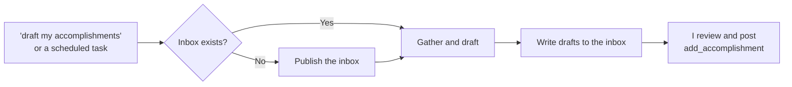

# accomplishments-inbox skill

A Claude skill for my career accomplishments workflow. It drafts accomplishments
from my GitHub activity into a private **Accomplishments Inbox** artifact. I
review the drafts there and post them to my public AT Protocol repo, which my
portfolio at https://jlawcordova.com shows.

| File | What it is |
| --- | --- |
| [`SKILL.md`](SKILL.md) | The skill's instructions. |
| [`assets/accomplishments-inbox.html`](assets/accomplishments-inbox.html) | The inbox page the skill publishes as an artifact. |

## When it's used

When I ask "draft my accomplishments" (or a scheduled task asks for the
skill), Claude:

1. Finds my "Accomplishments Inbox" artifact. If I don't have one yet, it
   publishes one from `assets/accomplishments-inbox.html` first.
2. Reviews my last 7 days on GitHub and skips work that's already posted or
   drafted.
3. Writes up to 5 public-safe drafts to the inbox and tells me they're
   there. It never posts anything itself.



## Install

You need these connectors in claude.ai:

- **GitHub**, to read my activity.
- **jlawcordova AT Proto** (the [`jlawcordova-mcp`](../../../jlawcordova-mcp)
  server), for `list_accomplishments`, `add_accomplishment`, and
  `delete_accomplishment`.

Then install the skill where it'll run:

- **Claude Code:** nothing to do. Sessions on this repo load skills from
  `.claude/skills/` automatically.
- **claude.ai** (also needed for scheduled tasks, which run there):
  1. Optional: in `SKILL.md`, replace `<INBOX_URL>` with my inbox's URL once
     I have one. If I leave it, the skill finds the inbox by its title.
  2. Zip the folder from the repo root:

     ```sh
     cd .claude/skills && zip -r accomplishments-inbox.zip accomplishments-inbox
     ```

  3. Upload `accomplishments-inbox.zip` as a custom skill in claude.ai
     settings. If an older version is installed, replace it.

After changing anything in this folder, upload it to claude.ai again so
claude.ai uses the new version.

## Use it from a scheduled task (optional)

The skill doesn't set up any schedule. If I want drafts to arrive on their
own, I can create a scheduled task in claude.ai (for example, Mondays at
8:50 AM Manila time) whose prompt asks for the skill:

```text
Use the accomplishments-inbox skill to draft this week's accomplishments into
my Accomplishments Inbox: <INBOX_URL>. If the skill isn't available, send me
a push notification saying the accomplishments run couldn't find the
accomplishments-inbox skill, and stop.
```

Everything else (what to gather, the description style, the public-safety
rules, and when to notify me) lives in `SKILL.md`, so the prompt doesn't
change when the skill does.
