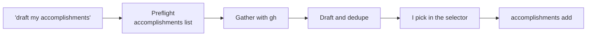

# accomplishments skill

A Claude Code skill for my career accomplishments workflow. It drafts
accomplishments from my GitHub activity, lets me pick which to post in Claude
Code's selector, and saves the picked ones to my public AT Protocol repo, which
my portfolio at https://jlawcordova.com shows.

| File | What it is |
| --- | --- |
| [`SKILL.md`](SKILL.md) | The skill's instructions. |

## When it's used

When I ask "draft my accomplishments", Claude:

1. Checks that the `accomplishments` CLI is installed and signed in.
2. Reviews my last 7 days on GitHub with `gh` and skips work that's already
   saved (`accomplishments list`).
3. Shows up to 5 public-safe drafts in the selector.
4. Saves only the drafts I pick with `accomplishments add`. The Worker then
   rebuilds the portfolio.

In a run that isn't interactive, it lists the drafts and saves nothing.

## Install

No connectors are needed. You need:

- **`gh`**, signed in to any GitHub account to read activity from.
- **The `accomplishments` CLI**, installed and signed in as `jlawcordova`.

[`docs/cli-setup.md`](../../../docs/cli-setup.md) covers installing the CLI,
signing in, the permission rule for `accomplishments list`, and linking this
skill into `~/.claude/skills` so it works from any directory. Sessions on this
repo load it from `.claude/skills/` without that link.
