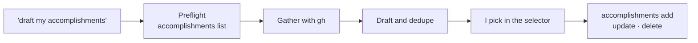

# accomplishments skill

A Claude Code skill for my career accomplishments workflow. It drafts
accomplishments from my GitHub activity, lets me pick which to post in Claude
Code's selector, and saves the picked ones to my public AT Protocol repo, which
my portfolio at https://jlawcordova.com shows.

| File | What it is |
| --- | --- |
| [`SKILL.md`](SKILL.md) | The skill's instructions. |

## When it's used

When I ask "draft my accomplishments", Claude:

1. Checks that the `accomplishments` CLI is installed and signed in.
2. Reviews my last 7 days on GitHub with `gh` and skips work that's already
   saved (`accomplishments list`).
3. Shows up to 5 public-safe drafts in the selector. Each has a fun title
   (one to three words, in the Stardew Valley way), a short description and an
   icon from https://jlawcordova.com/achievement-icons.json.
4. Saves only the drafts I pick with `accomplishments add`. The Worker then
   rebuilds the portfolio.

It also handles goals, which are locked accomplishments with no dates:

- "Add a goal: ..." drafts one with `done: false`, and saves it with `add`
  after I approve.
- If recent work matches a goal, it offers to mark it done. That is an
  `accomplishments update`, only when I choose it.
- Goals more than 14 days old come up in their own question, "Delete these
  stale goals?". Only the ones I confirm are deleted.

In a run that isn't interactive, it lists the drafts and saves, updates and
deletes nothing.



## Install

No connectors are needed. You need:

- **`gh`**, signed in to any GitHub account to read activity from.
- **The `accomplishments` CLI** 1.1.0 or later (it adds `update`), installed
  and signed in as `jlawcordova`. The skill checks this and stops if it's older.

Both come from the latest
[release](https://github.com/jlawcordova/jlawcordova-atproto/releases). The
CLI is one executable for Apple Silicon Macs; add `~/.local/bin` to your
`PATH` if it isn't there, and if you installed 1.x with npm, run
`npm uninstall -g jlawcordova-cli` first:

```sh
mkdir -p ~/.local/bin
curl -fsSL https://github.com/jlawcordova/jlawcordova-atproto/releases/latest/download/accomplishments-darwin-arm64 -o ~/.local/bin/accomplishments
chmod +x ~/.local/bin/accomplishments
curl -sL https://github.com/jlawcordova/jlawcordova-atproto/releases/latest/download/accomplishments-skill.zip -o /tmp/accomplishments-skill.zip
unzip -o /tmp/accomplishments-skill.zip -d ~/.claude/skills
accomplishments login
```

[`docs/cli-setup.md`](https://github.com/jlawcordova/jlawcordova-atproto/blob/main/docs/cli-setup.md)
covers signing in, the permission rule for `accomplishments list` (`add`,
`update` and `delete` still ask first), installing
from a clone instead, and releasing. Sessions on this repo load the skill from
`.claude/skills/` without installing it.
