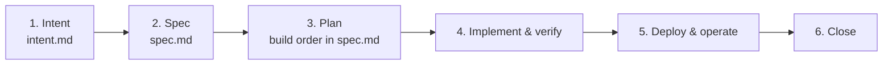

# CLAUDE.md

## Diagrams

- Write every diagram as a Mermaid code block (```` ```mermaid ````), in any
  Markdown file in this repo. No ASCII art, images, or other diagram formats.

## Intents

Work starts from an intent. Each one gets its own folder under
`docs/intents/`, named `YYYY-MM-<slug>` (for example
`docs/intents/2026-10-kickoff/`), and a row in the
[`docs/intents/README.md`](docs/intents/README.md) index.

Follow this flow, one step at a time:



1. **Intent** — `intent.md`: why, what "done" looks like, scope, constraints,
   success criteria, and decisions. Resolve open questions before moving on.
2. **Spec** — `spec.md`: contracts, design, and numbered acceptance tests. It
   implements the intent; where they disagree, the intent wins and the spec
   gets fixed.
3. **Plan** — a build order in `spec.md`: small, verifiable steps, each naming
   the acceptance tests it must pass.
4. **Implement & verify** — build one step at a time against the spec, with
   its tests. Ask before writing to real data or deploying. As soon as a
   build step's acceptance tests pass, record them without asking: update the
   progress line under step 4 of the intent's AI-native SDLC list, and the
   Verification section of the step's open PR (what ran, the result, and any
   rkeys or run IDs), then commit and push to that PR's branch. Record only
   what was actually run and seen; a test that wasn't run stays listed as not
   verified. With no open PR, include the record in the step's next PR.
5. **Deploy & operate** — ship it and confirm the success criteria.
6. **Close** — mark `intent.md` and `spec.md` **Closed** in their status
   lines, mark each SDLC step done, and set the status in the index.

Both files start with a status line:
`> Status: <Draft | vX.Y | Closed> — Owner: J. Law Cordova — Date: YYYY-MM-DD`.
A closed intent is a record; new work goes in a new intent, not an edit to a
closed one. Docs that outlive an intent (setup guides, prompts) go in
`docs/`, not in the intent folder.
