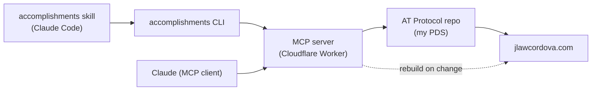

# jlawcordova-atproto

My career accomplishments, kept as records in my own
[AT Protocol](https://atproto.com) repo instead of a résumé, a review form or
a chat thread. They're public, typed and portable, and my portfolio at
<https://jlawcordova.com> reads them straight from the repo.

I write to them from Claude: a Claude Code skill drafts accomplishments from
my recent GitHub activity, I pick which to keep, and a small CLI saves them.

## Install the CLI and skill

The CLI and the skill are released together from the
[latest release](https://github.com/jlawcordova/jlawcordova-atproto/releases).
You need an Apple Silicon Mac and, for the skill,
[Claude Code](https://claude.com/claude-code) and the
[`gh` CLI](https://cli.github.com) signed in to GitHub. The CLI is a single
executable, so it needs no Node or Bun.

Only `jlawcordova` can sign in and write. Everyone else can read the public
records. If you're not me, this is a reference setup rather than something
you can use as is.

1. Install the CLI into `~/.local/bin` (add it to your `PATH` if it isn't
   there):

   ```sh
   mkdir -p ~/.local/bin
   curl -fsSL https://github.com/jlawcordova/jlawcordova-atproto/releases/latest/download/accomplishments-darwin-arm64 -o ~/.local/bin/accomplishments
   chmod +x ~/.local/bin/accomplishments
   ```

   Use `curl`, not a browser download, which macOS would refuse to run. If
   you installed 1.x with npm, run `npm uninstall -g jlawcordova-cli` first.

2. Install the skill into your user skills:

   ```sh
   curl -sL https://github.com/jlawcordova/jlawcordova-atproto/releases/latest/download/accomplishments-skill.zip -o /tmp/accomplishments-skill.zip
   unzip -o /tmp/accomplishments-skill.zip -d ~/.claude/skills
   ```

3. Sign in. It prints a code and opens GitHub's device page:

   ```sh
   accomplishments login
   ```

4. Start Claude Code and ask it to "draft my accomplishments".

The token goes in the macOS keychain. `ACCOMPLISHMENTS_TOKEN`, when set, is
used instead. [`docs/cli-setup.md`](docs/cli-setup.md) covers
signing in, the Claude Code permission rule, installing from a clone,
signing out and revoking the token.

## Update

Releases are tagged `cli-v<version>`. To update, run the install commands
again: they always fetch the latest release, and `unzip -o` overwrites the
old skill. You stay signed in.

```sh
curl -fsSL https://github.com/jlawcordova/jlawcordova-atproto/releases/latest/download/accomplishments-darwin-arm64 -o ~/.local/bin/accomplishments
chmod +x ~/.local/bin/accomplishments
curl -sL https://github.com/jlawcordova/jlawcordova-atproto/releases/latest/download/accomplishments-skill.zip -o /tmp/accomplishments-skill.zip
unzip -o /tmp/accomplishments-skill.zip -d ~/.claude/skills
```

To see which CLI version you have, and to compare it with the latest
release:

```sh
accomplishments --version
```

Update both together. The skill checks the CLI version and stops if it's too
old for what it needs. If you linked the skill from a clone instead of
unzipping it, `git pull` updates it, and `rm` the link before unzipping or the
zip writes into the clone.

## How it works



## What's in this repo

| Path | What it is |
| --- | --- |
| [`lexicons/`](lexicons) | The `com.jlawcordova.profile.accomplishment` record schema. |
| [`shared/`](shared) | The TypeScript validator for the record, shared by the Worker and the CLI. |
| [`jlawcordova-mcp/`](jlawcordova-mcp) | The MCP server (a Cloudflare Worker) that lists, adds, updates and deletes records. Only I can write. |
| [`jlawcordova-cli/`](jlawcordova-cli) | The `accomplishments` command. It signs in with GitHub and calls the Worker. |
| [`.claude/skills/accomplishments/`](.claude/skills/accomplishments) | The Claude Code skill that drafts accomplishments and saves the ones I pick. |
| [`docs/`](docs) | Setup guides and the [intents](docs/intents/README.md) that drove the work. |

The repo uses [Bun](https://bun.sh) (the version is in the root
`package.json`). From the root, run `bun install`, then `bun run typecheck`
and `bun run test`.

## Learn more

- [`docs/cli-setup.md`](docs/cli-setup.md): the CLI and skill, and how a
  release is cut.
- [`docs/setup.md`](docs/setup.md): the accounts, secrets and deploy behind the
  Worker.
- [`docs/intents/`](docs/intents/README.md): why each piece exists and how it
  was specified and verified.
