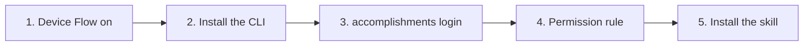

# Setup: the accomplishments CLI and skill

How to install the `accomplishments` CLI, sign in, and use the
`accomplishments` skill from Claude Code. The design is in
[`spec.md`](intents/2026-10-cli/spec.md), and the Bun build and release in
the [Bun spec](intents/2026-10-bun/spec.md). The Worker it talks to is set up in
[`setup.md`](setup.md).



## 1. Turn on Device Flow (once)

The CLI signs in with GitHub's device flow, using the production OAuth App
from [`setup.md`](setup.md#a4-github-oauth-apps-two). Go to
<https://github.com/settings/developers> → **OAuth Apps** → `jlawcordova-mcp`,
tick **Enable Device Flow**, and save. The app's client ID must match
`GITHUB_CLIENT_ID` in `jlawcordova-mcp/wrangler.jsonc`.

## 2. Install the command

The CLI is one executable for Apple Silicon Macs. It needs no Node or Bun.
Install it from the latest
[release](https://github.com/jlawcordova/jlawcordova-atproto/releases), with
no clone needed:

```sh
mkdir -p ~/.local/bin
curl -fsSL https://github.com/jlawcordova/jlawcordova-atproto/releases/latest/download/accomplishments-darwin-arm64 -o ~/.local/bin/accomplishments
chmod +x ~/.local/bin/accomplishments
accomplishments --version
accomplishments list --limit 1   # exit 3 means "not signed in yet"
```

If `accomplishments` isn't found, add `~/.local/bin` to your `PATH`. Use
`curl`, not a browser: a browser marks the download as quarantined, and macOS
then refuses to run it because it isn't notarized. Running the same commands
again updates it.

**Moving from the npm install** (1.x): remove it first, so two
`accomplishments` commands don't compete on the `PATH`. You stay signed in,
because the token is in the keychain.

```sh
npm uninstall -g jlawcordova-cli
```

**For development**, build the binary from a clone and copy it to the same
place. Build again after changing `src/`. To run the source without
building, use `bun jlawcordova-cli/src/main.ts <command>`.

```sh
bun install
bun run --filter jlawcordova-cli build
cp jlawcordova-cli/dist/accomplishments-darwin-arm64 ~/.local/bin/accomplishments
```

## 3. Sign in

```sh
accomplishments login
```

It prints a code and opens <https://github.com/login/device>. Check that the
browser is signed in to GitHub as **`jlawcordova`**, enter the code, and
approve. Any other account is refused and nothing is stored.

The token goes in the macOS keychain (service `jlawcordova-accomplishments`).
On other systems, set `ACCOMPLISHMENTS_TOKEN` instead; it's read first when
set. The `gh` CLI's account doesn't matter: the CLI never uses `gh`'s token.

## 4. Allow `list` in Claude Code

The repo's [`.claude/settings.json`](../.claude/settings.json) allows
`accomplishments list` without a prompt:

```json
{
  "permissions": {
    "allow": ["Bash(accomplishments list:*)"]
  }
}
```

To get the same outside this repo, add the rule to `~/.claude/settings.json`.
`add`, `update` and `delete` are left out on purpose, so Claude Code asks before every
write.

## 5. Install the skill

Sessions on this repo load the skill from `.claude/skills/accomplishments`.
To use it from any directory, install it into your user skills from the latest
release:

```sh
curl -sL https://github.com/jlawcordova/jlawcordova-atproto/releases/latest/download/accomplishments-skill.zip -o /tmp/accomplishments-skill.zip
unzip -o /tmp/accomplishments-skill.zip -d ~/.claude/skills
```

Or, from a clone, link it so it follows the repo (run from the repo root):

```sh
ln -s "$PWD/.claude/skills/accomplishments" ~/.claude/skills/accomplishments
```

Use one or the other. If `~/.claude/skills/accomplishments` is already a link,
`rm` it before unzipping, or the zip writes into the clone.

The same zip uploads to claude.ai as a custom skill. Then ask Claude Code to
"draft my accomplishments".

## Sign out and revoke

- **Sign out** on this machine:

  ```sh
  security delete-generic-password -s jlawcordova-accomplishments
  ```

- **Revoke** the token everywhere: GitHub → **Settings** → **Applications** →
  **Authorized OAuth Apps** → `jlawcordova-mcp` → **Revoke**. The token has no
  scopes, so it can't read or change anything on GitHub, but revoke it if the
  machine is lost.

## Releasing a new version

The CLI and the skill are released together, with the version in
`jlawcordova-cli/package.json`
([spec section 6.2](intents/2026-10-bun/spec.md#62-release-cliyml)).

1. Bump `version` in `jlawcordova-cli/package.json` in a PR (run
   `bun install` so `bun.lock` follows), and merge it.
2. Tag the merge on `main` and push the tag:

   ```sh
   git fetch origin
   git tag -a cli-v<version> -m "accomplishments <version>" origin/main
   git push origin cli-v<version>
   ```

The **Release the accomplishments CLI and skill** workflow checks that the tag
matches the version and is on `main`, runs the tests on an Apple Silicon
runner, builds the binary and checks its signature, smoke-tests it with no Bun
or Node on the `PATH`, and publishes `accomplishments-darwin-arm64` and
`accomplishments-skill.zip`. If a guard fails, nothing is published: delete the
tag (`git push origin :refs/tags/cli-v<version>`), fix it, and tag again.
