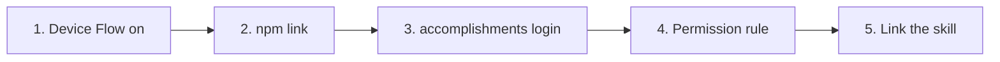

# Setup: the accomplishments CLI and skill

How to install the `accomplishments` CLI, sign in, and use the
`accomplishments` skill from Claude Code. The design is in
[`spec.md`](intents/2026-10-cli/spec.md). The Worker it talks to is set up in
[`setup.md`](setup.md).



## 1. Turn on Device Flow (once)

The CLI signs in with GitHub's device flow, using the production OAuth App
from [`setup.md`](setup.md#a4-github-oauth-apps-two). Go to
<https://github.com/settings/developers> → **OAuth Apps** → `jlawcordova-mcp`,
tick **Enable Device Flow**, and save. The app's client ID must match
`GITHUB_CLIENT_ID` in `jlawcordova-mcp/wrangler.jsonc`.

## 2. Install the command

The CLI runs from this repo on Node 22. It isn't published to npm.

```sh
npm install
cd jlawcordova-cli && npm link
accomplishments list --limit 1   # exit 3 means "not signed in yet"
```

## 3. Sign in

```sh
accomplishments login
```

It prints a code and opens <https://github.com/login/device>. Check that the
browser is signed in to GitHub as **`jlawcordova`**, enter the code, and
approve. Any other account is refused and nothing is stored.

The token goes in the macOS keychain (service `jlawcordova-accomplishments`).
On other systems, set `ACCOMPLISHMENTS_TOKEN` instead; it's read first when
set. The `gh` CLI's account doesn't matter: the CLI never uses `gh`'s token.

## 4. Allow `list` in Claude Code

The repo's [`.claude/settings.json`](../.claude/settings.json) allows
`accomplishments list` without a prompt:

```json
{
  "permissions": {
    "allow": ["Bash(accomplishments list:*)"]
  }
}
```

To get the same outside this repo, add the rule to `~/.claude/settings.json`.
`add` and `delete` are left out on purpose, so Claude Code asks before every
write.

## 5. Use the skill from any directory

Sessions on this repo load the skill from `.claude/skills/accomplishments`.
To use it anywhere, link it into your user skills:

```sh
ln -s "$PWD/.claude/skills/accomplishments" ~/.claude/skills/accomplishments
```

Run that from the repo root. Then ask Claude Code to "draft my
accomplishments".

## Sign out and revoke

- **Sign out** on this machine:

  ```sh
  security delete-generic-password -s jlawcordova-accomplishments
  ```

- **Revoke** the token everywhere: GitHub → **Settings** → **Applications** →
  **Authorized OAuth Apps** → `jlawcordova-mcp` → **Revoke**. The token has no
  scopes, so it can't read or change anything on GitHub, but revoke it if the
  machine is lost.
