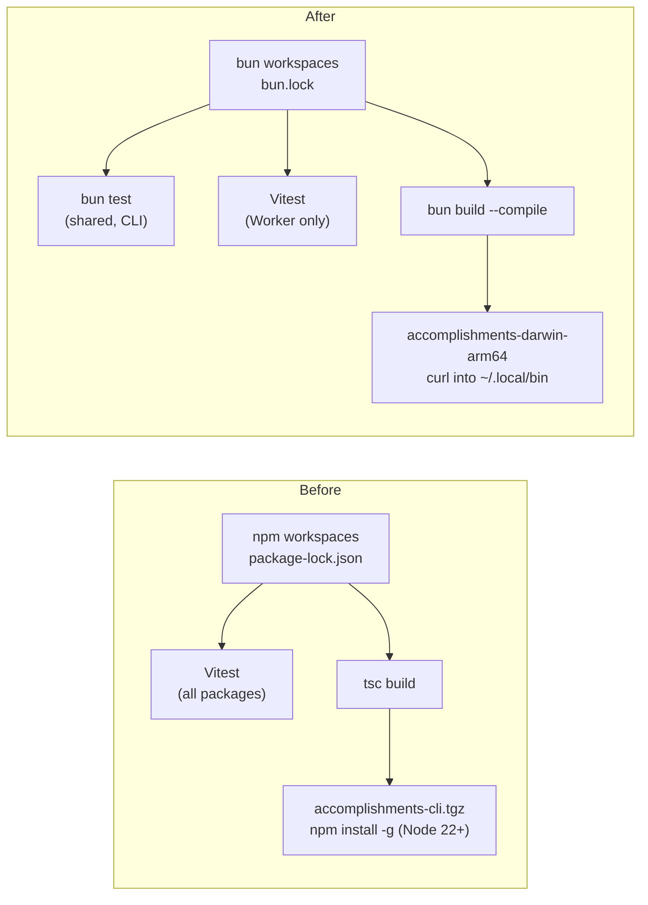

# Intent: Move the repo to Bun

> Status: Closed — Owner: J. Law Cordova — Date: 2026-10-07

## Why

The repo runs on Node and npm: npm workspaces and `package-lock.json`, Vitest
for every package, `tsc` to build the CLI, and an npm tarball as the CLI's
release. Installing the CLI needs Node 22 or later, and `npm install -g` from
a URL.

Bun does the package manager, script runner, test runner and bundler in one
tool, and is faster at each. It can also compile the CLI into one executable,
so installing it needs no runtime at all: download one file and run it.

## Intent

Make **Bun** the repo's package manager, script runner, test runner and
build tool, and release the **`accomplishments` CLI as a compiled Bun
binary** instead of an npm tarball.

The CLI's commands, output and exit codes don't change, and neither do the
Worker's behavior, the records, the Lexicon or the skill's workflow.

## Outcomes (what "done" looks like)

1. `bun install` installs every workspace from a committed `bun.lock`.
   `package-lock.json` and `.npmrc` are gone.
2. `bun run typecheck` and `bun run test` at the root check and test every
   package.
3. The tests in `shared/` and `jlawcordova-cli/` run on `bun test`. The
   Worker's tests stay on Vitest, launched by Bun.
4. The CLI is compiled with `bun build --compile` into one macOS arm64
   executable. It behaves exactly like the Node build: same commands, JSON,
   exit codes, keychain use and device-flow login.
5. `accomplishments --version` prints the CLI's version. It replaces
   `npm ls -g jlawcordova-cli` as the way to check what's installed.
6. A `cli-v*` tag publishes one GitHub Release with
   `accomplishments-darwin-arm64` and the skill zip. The first such release
   is **2.0.0**.
7. Both workflows (deploy the Worker, release the CLI) use Bun instead of
   npm, and still test before they deploy or publish.
8. The README, `docs/cli-setup.md`, `docs/setup.md` and the skill's install
   and update steps use Bun and the binary, and say how to move off the npm
   install.

## Scope

### In scope
- Root and workspace `package.json` files, `bun.lock`, and removing
  `package-lock.json` and `.npmrc`.
- `shared/` and `jlawcordova-cli/` tests moved from Vitest to `bun:test`, and
  their `@types/node` replaced by `@types/bun`.
- The CLI's build: `bun build --compile` replaces `tsc -p
  tsconfig.build.json`, and the package tests (P1, P2) are rewritten for the
  binary.
- A `--version` flag on the CLI.
- `.github/workflows/deploy-mcp.yml` and `.github/workflows/release-cli.yml`.
- The README, `docs/cli-setup.md`, `docs/setup.md`, the skill's `SKILL.md`
  and `README.md`, and `.claude/settings.json` if it needs to change.
- Release 2.0.0, and moving my own machine from the npm install to the
  binary.

### Out of scope
- Any change to what the CLI does, the Worker's behavior, the records, the
  Lexicon or the portfolio.
- Moving the Worker's tests off Vitest. `@cloudflare/vitest-pool-workers` runs
  them inside workerd, which `bun test` can't do.
- The Worker's runtime. It runs on Cloudflare Workers; Bun only installs its
  dependencies and launches its tools.
- Binaries for Intel Macs, Linux or Windows.
- Signing with an Apple Developer ID or notarizing the binary.
- Publishing to the npm registry or Homebrew.
- Rewriting closed intents and specs. They stay as the record of how things
  were done with npm.

## Constraints & principles

- **Behavior doesn't change.** Every existing test keeps its ID and its
  assertions. Only the test runner, imports and test fakes' types change.
  The exceptions are P1 and P2, which test the `tsc` build and the npm
  tarball. Tests of the binary replace them.
- **One lockfile, one package manager.** No npm, pnpm or yarn lockfile is
  left behind, and CI installs with `bun install --frozen-lockfile`.
- **Pinned versions.** Bun's version is pinned in one place, used by both
  local work and CI, like every other dependency in the repo.
- **The binary runs on a clean Mac.** It needs no Node and no Bun, and
  starts without a Gatekeeper prompt when installed with the documented
  `curl` command.
- **Release guards stay.** The tag must match the version and be on `main`,
  tests run first, and the installed binary is smoke-tested before anything
  is published.
- **Secrets are untouched.** The token stays in the macOS keychain, and the
  Worker's secrets and deploy token don't change.

## Success criteria

- On a fresh clone, `bun install`, `bun run typecheck` and `bun run test`
  pass. `shared` and the Worker keep their test counts (62 and 74), and
  the CLI keeps its 42 tests other than P1 and P2.
- `bun run dev` serves the Worker locally, and a deploy from `main`
  with the new workflow leaves the MCP endpoint and API working.
- On my Mac with no Node on the PATH, the binary from the 2.0.0 release
  installs with the documented command, `--version` prints `2.0.0`, `list`
  returns my records with the keychain token, and the skill drafts and saves
  through it.
- The npm install is removed from my machine, and `which accomplishments`
  points at `~/.local/bin/accomplishments`.

## Decisions

| Question | Decision |
| --- | --- |
| How far the move goes | All the way: package manager, scripts, tests (except the Worker's), the CLI's build and its release |
| Worker tests | Stay on Vitest with `@cloudflare/vitest-pool-workers`, launched by `bun run test`. They need workerd |
| Worker tools on Node | `wrangler` and Vitest run on Bun if `wrangler dev`, the Worker's tests and `wrangler deploy --dry-run` all pass that way. If any fails, those tools keep running on Node in local work and CI, and the spec says which. Checked on 2026-10-07: only `wrangler dev` fails on Bun, so it alone stays on Node ([spec section 3](spec.md#3-which-runtime-runs-what)) |
| CLI distribution | A `bun build --compile` executable, released as a GitHub Release asset. Not a Bun-run package, which would still need a runtime installed |
| Platforms | macOS arm64 only: `accomplishments-darwin-arm64`. Other systems are out of scope, as in the CLI intent |
| Install location | `~/.local/bin/accomplishments`, with `curl -L` and `chmod +x`. No sudo. The docs say to add `~/.local/bin` to the PATH if it isn't there |
| Version | 2.0.0. The commands don't change, but the release asset and the install and update steps do, and the npm install has to be removed by hand |
| Checking the version | A new `--version` flag, reading the version from `package.json` at build time |
| Old npm install | The docs say to run `npm uninstall -g jlawcordova-cli` before installing the binary, so two `accomplishments` commands don't compete on the PATH |
| Skill | Its install and update text changes to the binary. Its checks stay: `--help` must list `update`. The skill and CLI still share one version |
| Closed intents | Left as they are. They describe what was done at the time |

## Open questions

None. Details go in [`spec.md`](spec.md).

## AI-native SDLC

All steps are done and the intent is closed.

1. **Intent** (this document) — done.
2. **Spec** — the package layout, scripts, test changes, the CLI build and
   `--version`, both workflows, the docs and skill changes, and acceptance
   tests in [`spec.md`](spec.md) — done.
3. **Plan** — the build order in [`spec.md`](spec.md#9-build-order) —
   done.
4. **Implement & verify** — done. Build steps 1 to 5 are in #26, one
   commit per step. Locally on Bun 1.4.2: `bun install --frozen-lockfile`,
   `bun run typecheck` and `bun run test` pass (shared 62, CLI 46, Worker
   74), and a planted type error or failing test makes them exit 1 (W1 to
   W3). With no Node on the `PATH`, a fresh install, typecheck, test and the
   Worker's dry run pass (W4). `bun run dev` on Node answers 401 with no
   token (W5). Bun's version is only in `packageManager`, and CI installs it
   from there (W6). The test diff is imports and the `fetch` fake types
   (W7). B1 to B5 pass; B5 was copied to a scratch folder, not
   `~/.local/bin`. F2, K1 and K2 pass. #26's checks passed (F1), and it
   merged as `d2f8ebb`.
5. **Deploy & operate** — done. The Worker deployed with Wrangler on
   Bun in run 37552254433 (version `db4c1d1a`, bundle 2,309.52 KiB), so the
   Node fallback in spec section 6.1 isn't needed. With no token, the API
   answers 401 and `POST /mcp` answers 401 with the OAuth challenge. The
   PDS still holds 12 records, the newest from 2026-10-03, so the deploy
   changed none. D1 isn't verified: no snapshot of `list` was taken before
   the deploy, and the stored CLI token is revoked (GitHub's `GET /user`
   answers 401 with it, and the pre-Bun CLI on Node is refused the same
   way), so `list` waits for a new `login`. F3 passed: `cli-v0.0.0` failed
   the version guard on the macOS runner in run 37552516896 and published
   nothing, and the tag was deleted. F4 passed: `cli-v2.0.0` released in run
   37552589390 on macOS 26.6.2 with every step green and B1 and B2 run. F5
   passed: the release holds only `accomplishments-darwin-arm64` and
   `accomplishments-skill.zip`. From `releases/latest`, the binary has no
   quarantine flag, its signature verifies, and it prints 2.0.0 with only
   `/usr/bin:/bin` on the `PATH`; the zip matches the repo's skill. After
   the owner removed the npm install, installed the release binary and ran
   `login` again, D1 passed against the PDS instead of a before-snapshot:
   `list --limit 100` returned 12 records, none skipped, each identical to
   its record on the PDS. D2 passed: `which accomplishments` is
   `~/.local/bin/accomplishments` (an interactive shell runs it too; a
   dangling npm link in the fnm Node `bin` is skipped), and with no Node on
   the `PATH` it prints 2.0.0 and `list` exits 0 with the keychain token. D3
   passed: the skill ran on the binary, read `jlawcordova`'s past 7 days with
   `gh`, offered four drafts, and saved only the two picked, "Travel Light"
   (`3mxapwaoqsi2f`) and "Fresh Coat" (`3mxapwcb4h22t`), each with
   `rebuild: "triggered"`.
6. **Close** — this intent and the spec are **Closed** and the index is
   updated — done.
