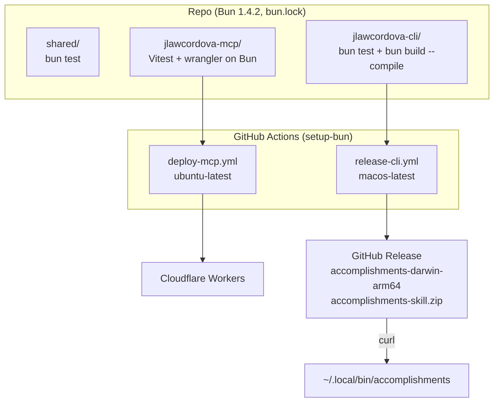

# Spec: Move the repo to Bun

> Status: Draft — Owner: J. Law Cordova — Date: 2026-10-07

Implements [`intent.md`](intent.md). Where they disagree, the intent wins and
this spec gets fixed.

## 1. Components



| Piece | Where | Change |
| --- | --- | --- |
| Workspace | `package.json`, `bun.lock` | `packageManager` pins Bun; scripts use `bun run --filter`. `package-lock.json` and `.npmrc` are deleted (section 2) |
| Shared | `shared/` | Tests on `bun:test`, `@types/bun` (section 4) |
| CLI | `jlawcordova-cli/` | Tests on `bun:test`, `@types/bun`, a narrower `fetch` type, a compiled build, `--version`, version 2.0.0 (sections 4 and 5) |
| Worker | `jlawcordova-mcp/` | Scripts run Vitest and Wrangler on Bun, except `dev` (section 3). No source change |
| Workflows | `.github/workflows/` | Bun instead of Node and npm. The release builds on macOS and publishes the binary (section 6) |
| Docs and skill | `README.md`, `docs/cli-setup.md`, `docs/setup.md`, `.claude/skills/accomplishments/` | Bun commands and the binary install (section 7) |

The Lexicon, the records, the Worker's source and behavior, the CLI's
commands and output, and the portfolio don't change.

## 2. Workspace

- The root `package.json` gets `"packageManager": "bun@1.4.2"`. That's the
  only place Bun's version is pinned: CI's `oven-sh/setup-bun` reads it with
  `bun-version-file: package.json`. Updating Bun means changing that field
  and running `bun install`.
- `bun.lock` (text format) replaces `package-lock.json`. `.npmrc` is deleted:
  its only setting, `legacy-peer-deps`, is npm's, and Bun installs this tree
  with no peer errors.
- Bun 1.4 uses isolated installs for workspaces (a `node_modules/.bun` store
  with links). That's the default and it's kept: the trial install linked
  `@jlawcordova/accomplishment` into the Worker and everything below ran.
- The Worker's dependency on the shared package becomes
  `"@jlawcordova/accomplishment": "workspace:*"`, so it can never resolve
  from a registry.
- No `trustedDependencies` are needed. The packages with install scripts
  (`workerd`, `esbuild`) are on Bun's default trusted list.
- Every dependency version stays exactly as it is, apart from
  `@types/node` → `@types/bun` (section 4).

Root scripts:

```json
{
  "test": "bun run --filter '*' test",
  "typecheck": "bun run --filter '*' typecheck"
}
```

`bun run --filter` exits non-zero when any package's script fails (checked:
a failing CLI typecheck gave exit 1).

## 3. Which runtime runs what

Checked on 2026-10-07 on a copy of `main` with Bun 1.4.2, with Node removed
from the `PATH` for every row marked "Bun":

| Task | Runtime | Result |
| --- | --- | --- |
| `bun install` | Bun | 266 packages, no peer errors |
| `shared` tests on `bun test` | Bun | 62 of 62 pass, unchanged except the import |
| `jlawcordova-cli` tests on `bun test` | Bun | 42 of 44 pass; P1 and P2 call `npx` and `npm` (replaced in section 5) |
| Worker tests, Vitest with `@cloudflare/vitest-pool-workers` | Bun | 74 of 74 pass, about twice as fast as on Node |
| `wrangler deploy --dry-run` | Bun | Bundles (2,309 KiB, 372 KiB gzip) |
| `wrangler dev` | Bun | Says "Ready" but every request hangs. **Fails** |
| `wrangler dev` | Node | `GET /api/accomplishments` with no token → 401, as expected |
| `bun build --compile` | Bun | A 62 MB arm64 executable, ad-hoc signed, `codesign --verify --strict` passes |
| The compiled binary with `env -i PATH=/usr/bin:/bin` | none | Usage → exit 2, unreachable URL → exit 4, starts in about 17 ms |

So, per the intent's decision on Worker tools:

- `test`, `typecheck` and `deploy` run on Bun, with `--bun` so they never
  pick up a Node that happens to be on the `PATH`.
- `dev` runs `wrangler dev` on **Node**, and needs Node on the machine. This
  is the only thing in the repo that does. `docs/setup.md` says so. Moving it
  to Bun is a later change, once Wrangler's dev server works there.

Worker scripts (`jlawcordova-mcp/package.json`):

```json
{
  "dev": "wrangler dev --port 8788",
  "deploy": "bun --bun wrangler deploy",
  "check": "bun --bun wrangler deploy --dry-run",
  "test": "bun --bun vitest run",
  "typecheck": "bun --bun tsc --noEmit"
}
```

`check` is new. It's the dry run that CI already does, given a name so local
work and CI run the same command.

## 4. Tests and types (`shared`, `jlawcordova-cli`)

- Test files import from `"bun:test"` instead of `"vitest"`. They only use
  `describe`, `it`, `expect`, `beforeEach`, `afterEach` and `afterAll`, which
  `bun:test` has with the same behavior. No assertion changes.
- `vitest` leaves both packages' `devDependencies`; `@types/node` is replaced
  by `@types/bun` `1.4.2` (matching Bun). Both `tsconfig.json` files change
  `"types": ["node"]` to `"types": ["bun"]`.
- Bun's `typeof fetch` has an extra `preconnect` property, so a plain async
  function no longer fits it. The CLI's `Deps.fetch` (in `src/api.ts`)
  becomes what the CLI actually calls:

  ```ts
  fetch: (url: string, init?: RequestInit) => Promise<Response>;
  ```

  The fakes in `test/cli.test.ts` and `test/login.test.ts` are typed
  `Deps["fetch"]`, and `login.test.ts` drops its `input as string | URL |
  Request` cast. `main.ts` still passes the global `fetch`. Checked: with
  these changes the CLI typechecks clean on `@types/bun`.
- Scripts: `"test": "bun test"` and `"typecheck": "bun --bun tsc --noEmit"`
  in both packages.

## 5. CLI build and `--version` (`jlawcordova-cli`)

### 5.1 Build

```json
{
  "version": "2.0.0",
  "scripts": {
    "build": "bun build --compile --minify --target=bun-darwin-arm64 src/main.ts --outfile dist/accomplishments-darwin-arm64 && rm -f .*.bun-build",
    "test": "bun test",
    "typecheck": "bun --bun tsc --noEmit"
  }
}
```

- `bin`, `files` and the `prepare` script are removed: the package is no
  longer installed with a package manager. `tsconfig.build.json` is deleted.
  `dist/` stays in `.gitignore`.
- `main.ts`'s shebang becomes `#!/usr/bin/env bun`, so `bun src/main.ts` and
  `./src/main.ts` both run the source in development. The compiled binary
  ignores it.
- Every `--compile` leaves a 62 MB `.<hash>.bun-build` temp file in the
  working directory (Bun 1.4.2, a known issue:
  [oven-sh/bun#14020](https://github.com/oven-sh/bun/issues/14020)). The
  build script deletes it, and `.gitignore` has `*.bun-build` in case a
  build is interrupted.
- No `--bytecode`: it emits CommonJS, which can't hold `main.ts`'s top-level
  `await` (checked: the build fails).
- The output is only for Apple Silicon Macs. Bun signs it ad hoc, which is
  enough for Apple Silicon to run it. It isn't Developer ID-signed or
  notarized. A file fetched with `curl` gets no quarantine flag, so
  Gatekeeper doesn't stop it. A browser download would, and the docs say to
  use `curl`.

### 5.2 `--version`

`accomplishments --version` prints, on stdout, with exit 0:

```json
{
  "version": "2.0.0"
}
```

- Handled in `run()` before any other command, like `login`. It needs no
  token, reads no stdin and sends no request.
- `--version` with any other argument is a usage error (exit 2).
- The version comes from `import pkg from "../package.json" with { type:
  "json" }`, which the compiled build inlines. The CLI's `tsconfig.json`
  gets `"resolveJsonModule": true`.
- The usage text gets a line, `accomplishments --version`. `--help` stays as
  it is: an unknown command, exit 2, usage on stderr. The skill relies on
  that.

### 5.3 Package tests (`test/package.test.ts`)

P1 and P2 tested the `tsc` build and the npm tarball, which no longer exist.
They're replaced by B1 and B2 (section 8), in the same file. Both run only on
Apple Silicon (`describe.skipIf`), because the binary only runs there. B1
runs the package's real `bun run build`, so it tests the release's own
command, and writes to `dist/`, which is ignored.

### 5.4 Development install

From a clone, build and copy the binary to the same place a release goes:

```sh
bun run --filter jlawcordova-cli build
cp jlawcordova-cli/dist/accomplishments-darwin-arm64 ~/.local/bin/accomplishments
```

`npm link` (the CLI spec's P7) has no replacement. One install location
means no question about which `accomplishments` is on the `PATH`.

## 6. Workflows

Both workflows replace `actions/setup-node` with `oven-sh/setup-bun` at its
current major version (checked when the workflow is written), with
`bun-version-file: package.json`, and install with
`bun install --frozen-lockfile`.

### 6.1 `deploy-mcp.yml`

- `paths` (push and pull request): `package-lock.json` and `.npmrc` are
  replaced by `bun.lock`. The rest stays.
- The test job runs `bun run typecheck`, `bun run test` and
  `bun run --filter jlawcordova-mcp check`, on `ubuntu-latest`. B1 and B2
  skip there.
- The deploy job runs `bun run --filter jlawcordova-mcp deploy` with the same
  `CLOUDFLARE_API_TOKEN`. If the real deploy fails on Bun when the dry run
  passed, the fallback is to drop `--bun` from `deploy` (Node is on the
  GitHub runner), and the spec and the intent's progress line record that.
- Concurrency, permissions and the `main`-only deploy are unchanged.

### 6.2 `release-cli.yml`

Runs on `macos-latest` (Apple Silicon), so the binary is built and
smoke-tested on the platform it's for.

1. Checkout with full history, then set up Bun.
2. Guards, as before: the tag's version must equal
   `jlawcordova-cli/package.json`'s (read with `bun -p`), and the tagged
   commit must be on `main`.
3. `bun install --frozen-lockfile`, `bun run typecheck`, `bun run test`.
   B1 and B2 run here.
4. `bun run --filter jlawcordova-cli build`, then
   `codesign --verify --strict` on the binary.
5. Zip the skill, with the same two checks on its contents as now.
6. Smoke test: copy the binary to `$RUNNER_TEMP/bin/accomplishments` and run
   it with `env -i PATH=/usr/bin:/bin HOME="$HOME"`, so no Bun or Node is
   reachable:
   - `--help` exits 2.
   - `--version` prints the tag's version.
   - `list` exits 3, because the runner's keychain has no token. It also
     sets `ACCOMPLISHMENTS_URL=http://127.0.0.1:9`, so any request would be
     exit 4 instead.
7. `gh release create` with `accomplishments-darwin-arm64` and
   `accomplishments-skill.zip`. No `.tgz`.

## 7. Docs and skill

The install and update command, used everywhere it's needed:

```sh
mkdir -p ~/.local/bin
curl -fsSL https://github.com/jlawcordova/jlawcordova-atproto/releases/latest/download/accomplishments-darwin-arm64 -o ~/.local/bin/accomplishments
chmod +x ~/.local/bin/accomplishments
```

| File | Change |
| --- | --- |
| `README.md` | Install and Update use the binary. Requirements say an Apple Silicon Mac instead of Node 22. A "Moving from the npm install" note: `npm uninstall -g jlawcordova-cli` first. `accomplishments --version` replaces `npm ls -g`. "Add `~/.local/bin` to your `PATH` if it isn't" |
| `docs/cli-setup.md` | Section 2 uses the binary, and the development install is section 5.4's. "Releasing" bumps the version with `bun install` keeping `bun.lock` in step. The asset names change |
| `docs/setup.md` | `npx wrangler` → `bunx wrangler`. `bun run dev` needs Node (section 3). "the root npm files" → "the root `package.json` and `bun.lock`" |
| `.claude/skills/accomplishments/SKILL.md` | Preflight: "command not found" gives the install command above in one line, with no Node requirement. "Older than 1.1.0" points to the same command. The `--help`/`update` check stays |
| `.claude/skills/accomplishments/README.md` | Same install command |
| `.claude/settings.json` | No change: the rule matches the command name, not how it was installed |

The closed intents and specs keep their npm commands (the intent's
decision).

## 8. Acceptance tests

### Workspace and tests

| # | Test |
| --- | --- |
| W1 | On a fresh clone, `bun install --frozen-lockfile` succeeds. No `package-lock.json`, `.npmrc` or `tsconfig.build.json` is tracked, and no `package.json` script calls `npm` or `npx` |
| W2 | `bun run typecheck` passes in all three packages, and a type error in any one of them makes it exit non-zero |
| W3 | `bun run test` passes: `shared` 62 on `bun test`, the CLI's 42 existing tests plus the new ones on `bun test`, and the Worker's 74 on Vitest. A failing test in any package makes it exit non-zero |
| W4 | With no Node on the `PATH`, W1 to W3 and `bun run --filter jlawcordova-mcp check` pass |
| W5 | `bun run dev` in `jlawcordova-mcp` (with Node) serves the Worker: `GET /api/accomplishments` with no token returns 401 |
| W6 | Bun's version appears in one place, `packageManager`, and both workflows read it from there |
| W7 | Every test ID that existed before the move (apart from P1 and P2) still exists, with the same assertions. The diff to test files is imports, the `fetch` fake types and the one cast |

### CLI binary and `--version`

| # | Test |
| --- | --- |
| B1 | `bun run build` writes an arm64 Mach-O executable whose `codesign --verify --strict` passes, and leaves no `.bun-build` file behind |
| B2 | That binary, run with only `PATH=/usr/bin:/bin`: `--help` exits 2 with usage on stderr; `--version` prints `{"version": <package.json version>}` and exits 0; `list` with `ACCOMPLISHMENTS_TOKEN` set and an unreachable `ACCOMPLISHMENTS_URL` exits 4 |
| B3 | `run(["--version"])` prints the version JSON, exits 0, and reads no token or stdin and calls no `fetch`; `--version` with another argument exits 2 and calls nothing |
| B4 | The usage text lists `--version`, and `--help` still exits 2 |
| B5 | Section 5.4's development install gives a working `accomplishments` whose `--version` matches `package.json` |

### Workflows

| # | Test |
| --- | --- |
| F1 | On this work's PR, `deploy-mcp.yml`'s test job runs on Bun with no `setup-node` step and passes: install, typecheck, test and `check` |
| F2 | `deploy-mcp.yml`'s `paths` list `bun.lock` and no longer list `package-lock.json` or `.npmrc` |
| F3 | A `cli-v*` tag whose version doesn't match `package.json` fails the release workflow and creates no release |
| F4 | `cli-v2.0.0` on `main` runs the release on `macos-latest`: guards, tests (with B1 and B2), build, signature check and the smoke test all pass |
| F5 | Release 2.0.0 has exactly `accomplishments-darwin-arm64` and `accomplishments-skill.zip` |

### Docs and skill

| # | Test |
| --- | --- |
| K1 | `README.md`, `docs/cli-setup.md`, `docs/setup.md` and the skill's two files have no `npm`, `npx` or Node requirement left, apart from the `npm uninstall -g jlawcordova-cli` move note and the Node needed by `bun run dev` |
| K2 | The skill's preflight gives the curl install command when `accomplishments` isn't found, and when `--help` doesn't list `update` |

### Deploy and my machine

| # | Test |
| --- | --- |
| D1 | After the merge, `deploy-mcp.yml` deploys with Wrangler on Bun. `accomplishments list --limit 100` returns the same records as before the deploy, and an unauthenticated `POST /mcp` still returns 401 with the OAuth challenge |
| D2 | On my Mac: `npm uninstall -g jlawcordova-cli`, then section 7's command. `which accomplishments` is `~/.local/bin/accomplishments`. With no Node on the `PATH`, `--version` prints `2.0.0` and `list` returns my records using the keychain token |
| D3 | The skill, run for real against the 2.0.0 binary, passes preflight, drafts from `gh`, and saves only what I pick |

## 9. Build order

The intent and this spec go in one PR. The build goes in a second PR, one
commit per step. Each step ends green (`bun run test`, `bun run typecheck`)
before the next.

1. **Workspace.** `packageManager`, `bun.lock`, delete `package-lock.json`
   and `.npmrc`, `workspace:*`, the root scripts, and the Worker's scripts
   with `check`. `shared` and the CLI still run Vitest, launched by Bun.
   *Passes: W1 (except `tsconfig.build.json`), W5, W6 (locally).*
2. **Tests on Bun.** `bun:test` imports, `@types/bun`, the `fetch` type, and
   `vitest` out of `shared` and the CLI. P1 and P2 are marked skipped with a
   note until step 3. *Passes: W2, W7.*
3. **CLI build and `--version`.** Build script, shebang, removing `bin`,
   `files`, `prepare` and `tsconfig.build.json`, `--version`, version 2.0.0,
   and B1 and B2 in place of P1 and P2. *Passes: W1, W3, W4, B1 to B5.*
4. **Workflows.** Both files as in section 6. *Passes: F2 now, and F1 when
   the PR's checks run.*
5. **Docs and skill.** Section 7. *Passes: K1, K2.*
6. **Merge, deploy and release** (ask first). Merging deploys the Worker.
   Then push a mismatched tag (`cli-v0.0.0`), and after it fails, delete it
   and push `cli-v2.0.0`. *Passes: D1, F3, F4, F5.*
7. **Move my machine** (ask first). Uninstall the npm build and install the
   release binary, then a real skill run. *Passes: D2, D3.*
8. **Close.** Mark this intent and spec **Closed**, mark each SDLC step
   done, and update the index.
