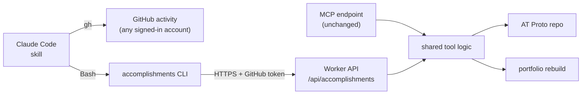

# Intent: Accomplishments CLI for Claude Code

> Status: **v1.0** — Owner: J. Law Cordova — Date: 2026-10-02

## Why

The [kickoff intent](../2026-10-kickoff/intent.md) exposed list, add, and
delete as MCP tools on a deployed Worker, used from Claude through a custom
connector. My org doesn't allow custom connectors for Claude, so the
`accomplishments-inbox` skill can't reach the accomplishments tools or the
GitHub connector in the sessions I actually work in. A run of the skill
found neither connector, and could only show drafts in the conversation.

Claude Code can already run shell commands. A small command-line tool that
calls the Worker I already run gives Claude Code the same abilities without a
connector.

## Intent

Let me **list, add, and delete my accomplishments from a CLI**, so Claude Code
(and I) can use them through Bash, and make the `accomplishments-inbox` skill
work end to end in Claude Code using that CLI and `gh`.

The CLI is a thin client of the **Worker**, through a new HTTP API on it. The
Worker keeps the Bluesky app password and the rebuild token, as it does today.
The records, Lexicon, and portfolio don't change.

## Outcomes (what "done" looks like)

1. The Worker has an **HTTP API** for list, add, and delete that uses the same
   schema, validation, ordering, and error messages as the MCP tools. Both
   interfaces call the same code.
2. Only the GitHub account `jlawcordova` (checked by numeric user ID) can use
   the API. Any other account, including my work account, is refused.
3. A CLI, **`accomplishments`**, with `login`, `list`, `add`, and `delete`.
   Every command prints **JSON** to stdout, and the exit code says whether it
   worked.
4. `login` signs in once with GitHub in the browser and stores the result in
   the macOS keychain. After that the commands need no setup.
5. The `accomplishments-inbox` skill works in Claude Code with no connectors:
   it reads GitHub with `gh`, checks existing records with `list`, drafts
   accomplishments, lets me choose which to post with Claude Code's selector,
   and saves them with `add`.
6. After an `add` or `delete` the portfolio is rebuilt by the Worker, as it is
   today, and the output says whether it was.

## Scope

### In scope
- Worker: an authenticated API for list, add, and delete, built on the same
  logic as the MCP tools (the logic moves out of `tools.ts` so both call it).
- Worker: GitHub token verification for the API.
- A new workspace package, `jlawcordova-cli`, with the four commands.
- Skill changes: the CLI replaces the accomplishments connector, `gh` replaces
  the GitHub connector, and the Claude Code selector replaces the inbox page.
- A short setup guide in `docs/`, and a redeploy of the Worker.

### Out of scope (for now)
- Removing or changing the MCP endpoint. It stays for any client allowed to
  use it.
- The Accomplishments Inbox artifact. The skill stops using it. It can stay
  published; deleting it is a separate call.
- An `update` command (delete and recreate, as in v1).
- Publishing the CLI to npm. It runs from this repo.
- Any new field on the record, or any change to the Lexicon.
- Other platforms. I use macOS.

## Constraints & principles

- **Same records, same rules.** One Lexicon, one validator, one ordering, one
  code path behind both the MCP tools and the API.
- **Public records are public.** `add` publishes to the world. The CLI doesn't
  decide what is safe to publish, so the skill keeps its approval step: Claude
  runs `add` only for text I have chosen in the selector or typed myself.
- **Single-owner access.** Reading activity is open to any GitHub account I'm
  signed in to with `gh`, including work. Writing records is limited to
  `jlawcordova`, enforced by the Worker. An open write or delete API on my repo
  is unacceptable.
- **Least privilege.** The CLI's token proves who I am and grants nothing on
  GitHub (no scopes). The app password and the rebuild token never leave the
  Worker. Secrets are never printed, logged, or passed as command-line
  arguments.
- **Small and boring.** Three commands plus `login`, JSON out, no interactive
  prompts in the CLI itself, no config files.
- **The site never breaks on the data.** A failed rebuild trigger is reported,
  not fatal: the record is already saved and the daily build catches up.

## Success criteria

- In Claude Code with no connectors installed, "draft my accomplishments" runs
  the skill: it reads GitHub with `gh`, checks existing records with `list`,
  shows drafts in the selector, and saves what I pick with `add`.
- The saved records show up on https://jlawcordova.com after the rebuild.
- Records written through the API and through the MCP endpoint are
  indistinguishable when read back from either one.
- Calls with no token, a bad token, or a token for any other GitHub user
  (such as `netzon-jlaw`) create, list, and delete nothing.
- The Worker redeploys with no record loss, and the MCP endpoint still works.

## Decisions

| Question | Decision |
| --- | --- |
| Where the logic lives | In the Worker. The CLI is a thin client; it doesn't talk to the PDS or hold the app password |
| API shape | `GET /api/accomplishments`, `POST /api/accomplishments`, `DELETE /api/accomplishments/{rkey}`, JSON in and out, results shaped like the MCP tools' |
| CLI auth | GitHub **device flow** through the existing GitHub OAuth App, with no scopes. `login` prints a code, opens the browser, and stores the token in the macOS keychain. This works from a terminal with no local web server |
| API auth | The Worker looks the bearer token up with GitHub's `GET /user`, and admits only the owner's numeric user ID, the same check the MCP endpoint uses |
| Why not `gh auth token` | `gh` is signed in as my work account here, and its token has broad scopes. A separate scopeless token tied to `jlawcordova` is safer and doesn't depend on which account `gh` uses |
| Choosing what to post | Claude Code's selector (`AskUserQuestion`), multi-select, one option per draft with its title and key details. The built-in "Other" lets me type exactly what I want posted. Claude then shows the final text for any typed change before running `add` |
| Selector size | The selector allows 4 options per question, so more than 4 drafts are split across questions |
| Name and location | `jlawcordova-cli` workspace package; the command is `accomplishments` |
| Language | TypeScript on Node 22, same toolchain as the rest of the repo |
| GitHub activity | `gh`, with whichever account is signed in. The skill says which account it read, and I accept or edit the drafts. Work and personal accounts can describe the same work |
| Permissions | Allowlist `accomplishments list` only. `add` and `delete` keep Claude Code's prompt |

| Device flow | Reuse the existing OAuth App. Turning on "Enable Device Flow" in its settings is the first build step |
| Token lifetime | OAuth App tokens don't expire. Accepted: the token has no scopes and the Worker checks the user ID on every call. The setup guide says how to revoke it |
| Token verification | Not `GET /user`: the Worker checks the token against this app (`/applications/{client_id}/token`), so a token from another site where I used "Sign in with GitHub" can't be used |
| Skill name | Renamed to `accomplishments`; the inbox page is deleted |

## Open questions

None. Details are in [`spec.md`](spec.md).

## AI-native SDLC

1. **Intent** (this document) — done.
2. **Spec** — API contracts (paths, JSON shapes, errors, status codes), the
   device-flow login, the CLI's arguments and exit codes, the skill changes,
   and acceptance tests in [`spec.md`](spec.md) — done.
3. **Plan** — the build order in [`spec.md`](spec.md#8-build-order) — done.
4. **Implement & verify** — one step at a time with tests, including an
   end-to-end check against the real Worker and PDS (asking before writing real
   data or deploying) — in progress: build steps 2 to 5 are merged (#10 to #13),
   step 6 is verified against the deployed Worker (A1, A4, S7), and step 7's
   real write, read-back, and delete passed (A10, A14, S6). Step 8's skill,
   docs, and permission rule are in place; S1 to S3 pass, and S4 and S5 are
   still to verify.
5. **Deploy & operate** — redeploy the Worker, install the command, update the
   skill, and confirm the success criteria.
6. **Close** — mark this intent and the spec **Closed** and update the index.
