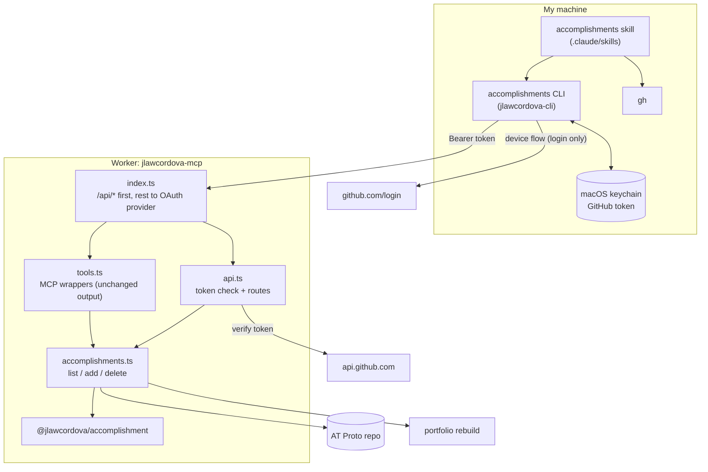

# Spec: Accomplishments CLI for Claude Code

> Status: **Draft** (v0.1) — Owner: J. Law Cordova — Date: 2026-10-02

Implements [`intent.md`](intent.md). Where they disagree, the intent wins and
this spec gets fixed.

## 1. Components



| Piece | Where | Change |
| --- | --- | --- |
| Operations | `jlawcordova-mcp/src/accomplishments.ts` | New. List, add, and delete moved out of `tools.ts` |
| MCP tools | `jlawcordova-mcp/src/tools.ts` | Call the operations. Output text and behavior unchanged |
| API | `jlawcordova-mcp/src/api.ts` | New. Routes and token verification |
| Router | `jlawcordova-mcp/src/index.ts` | Sends `/api/*` to `api.ts` before the OAuth provider |
| CLI | `jlawcordova-cli/` | New workspace package |
| Skill | `.claude/skills/accomplishments/` | Renamed from `accomplishments-inbox` and rewritten (section 5) |
| Docs | `docs/cli-setup.md` | New |

The Lexicon, `shared`, the MCP endpoint's behavior, and the portfolio don't
change.

## 2. Worker operations (`accomplishments.ts`)

The code in `tools.ts` becomes three functions that take `env` and return a
result instead of an MCP response. `tools.ts` and `api.ts` both call them, so
there is one implementation of validation, ordering, PDS access, and rebuild.

```ts
type Failure =
  | { ok: false; kind: "bad_request"; message: string }          // since / limit / rkey malformed
  | { ok: false; kind: "invalid"; errors: ValidationError[] }    // record failed validation
  | { ok: false; kind: "not_found"; message: string };           // rkey doesn't exist

listAccomplishments(env, { since?, limit? }): Promise<{ ok: true; value: { items; total; skippedInvalid } } | Failure>
addAccomplishment(env, input):                Promise<{ ok: true; value: { rkey; uri; cid; record; rebuild } } | Failure>
deleteAccomplishment(env, rkey):              Promise<{ ok: true; value: { rkey; deleted; rebuild } } | Failure>
```

- Unexpected failures (PDS errors) are thrown. Each caller turns them into its
  own error shape.
- The checks, limits, and messages are exactly those now in `tools.ts`:
  `since` is `YYYY-MM`, `limit` is a whole number 1 to 100 (default 50), the
  rkey is a 13-character TID.
- `tools.ts` renders `Failure` to the same text the tools return today. Its
  existing tests pass unchanged.

## 3. Worker API (`api.ts`)

### 3.1 Routing

`index.ts` checks the path first. Paths starting with `/api/` go to the API
handler; everything else goes to the OAuth provider as now. The API doesn't use
the provider's tokens.

All API responses are JSON with `cache-control: no-store`. There are no CORS
headers: the only client is a CLI.

### 3.2 Authentication

Every request needs `Authorization: Bearer <token>`, where the token is a
GitHub OAuth App user token issued to **this Worker's OAuth App** for `jlawcordova`.

1. A missing header, or a token that doesn't match `^gho_[A-Za-z0-9_]{20,255}$`,
   gets **401** without calling GitHub. This keeps junk requests from spending
   the app's GitHub rate limit.
2. The Worker calls
   `POST https://api.github.com/applications/{GITHUB_CLIENT_ID}/token` with HTTP
   Basic auth `GITHUB_CLIENT_ID:GITHUB_CLIENT_SECRET` and body
   `{"access_token": "<token>"}`, with a 5 s timeout.
   - **200**: the response names the user (`user.id`, `user.login`).
   - **404 or 422**: the token is invalid, revoked, or issued to some other app → **401**.
   - Any other status, a timeout, or a network error → **503**
     `{"error":"auth_unavailable"}`. It never admits the request.
3. The user must pass `isOwner(env, user)`: numeric ID and login both match.
   Otherwise **403**.

Why this call and not `GET /user`: `GET /user` accepts any GitHub token for
the owner, including one held by any third-party site where the owner has used
"Sign in with GitHub". The `/applications/{client_id}/token` call only
accepts tokens issued to this app, so the token proves "signed in through my
own CLI".

The token and the Authorization header are never logged or echoed.

### 3.3 Routes

| Method and path | Body | Success | Failures |
| --- | --- | --- | --- |
| `GET /api/accomplishments?since=&limit=` | none | **200** `{ items, total, skippedInvalid }` | 400 |
| `POST /api/accomplishments` | JSON object: `title`, `description`, `startDate`, optional `endDate`, `tags`, `links` | **201** `{ rkey, uri, cid, record, rebuild }` | 400, 413, 422 |
| `DELETE /api/accomplishments/{rkey}` | none | **200** `{ rkey, deleted, rebuild }` | 400, 404 |

Result bodies are exactly what the matching MCP tool returns as its JSON text.

Errors are `{ "error": "<code>", "message": "<text>" }`, plus `errors` for 422:

| Status | `error` | When |
| --- | --- | --- |
| 400 | `bad_request` | Malformed `since`, `limit`, or rkey; body isn't a JSON object |
| 401 | `unauthorized` | Section 3.2, steps 1 and 2 |
| 403 | `forbidden` | Valid token for a different GitHub user |
| 404 | `not_found` | Unknown path, or no such rkey |
| 405 | `method_not_allowed` | Known path, wrong method (with an `Allow` header) |
| 413 | `too_large` | Body over 64 KiB |
| 422 | `invalid` | Record failed validation; `errors` is `[{ field, message }]` |
| 502 | `upstream` | PDS request failed; `message` is the same short, secret-free text the MCP tools give |
| 503 | `auth_unavailable` | GitHub couldn't be reached to check the token |

`POST` ignores any `createdAt` or `$type` in the body: the Worker sets both.
Unknown fields are rejected as 422 by the validator.

### 3.4 Logging

One line per request through the existing `log` helper:
`{ event: "api", route, method, status, outcome }`, plus `rkey` when there is
one. No tokens, no record text.

### 3.5 Configuration

No new variables or secrets. It uses `GITHUB_CLIENT_ID`, the existing
`GITHUB_CLIENT_SECRET`, and the owner variables already in `wrangler.jsonc`.

## 4. CLI (`jlawcordova-cli`)

### 4.1 Package

- Workspace package `jlawcordova-cli` with `"bin": { "accomplishments": "src/main.ts" }`.
- Node 22.18 or later runs the TypeScript directly (type stripping), so there
  is no build step. Source uses `.ts` import suffixes and erasable syntax only.
- **No runtime dependencies.** It uses `fetch`, `node:child_process`, and
  `node:util`. Dev dependencies match the other packages.
- Install: `npm link` in the package directory puts `accomplishments` on the PATH.

### 4.2 Configuration

| Variable | Default | Purpose |
| --- | --- | --- |
| `ACCOMPLISHMENTS_URL` | `https://jlawcordova-mcp.jlawcordova.workers.dev` | Worker origin |
| `ACCOMPLISHMENTS_CLIENT_ID` | the production OAuth App's client ID | Used by `login` |
| `ACCOMPLISHMENTS_TOKEN` | unset | If set, used instead of the keychain. For tests and emergencies |

The client ID is public, so a default in the source is fine.

### 4.3 Commands

```
accomplishments login
accomplishments list [--since YYYY-MM] [--limit N]
accomplishments add            # JSON object on stdin
accomplishments delete <rkey>
```

- **`list`** → `GET /api/accomplishments`; prints the response body.
- **`add`** → reads all of stdin, requires it to parse as a JSON object, sends
  it as the `POST` body; prints the response body. The CLI doesn't validate the
  record itself: the Worker is the single validator, so the rules can't drift.
- **`delete`** → `DELETE /api/accomplishments/{rkey}`; prints the response body.
  The rkey is URL-encoded.
- No interactive prompts, apart from `login`'s code display.
- `--help` and unknown commands print usage to stderr and exit 2.

### 4.4 Output and exit codes

- **Success:** the response body, pretty-printed JSON, on stdout. Exit 0.
- **Failure:** a JSON object `{ "error": "<code>", "message": "<text>" }` on
  stderr, with the API's `errors` array included when present. Nothing on stdout.

| Exit | Meaning |
| --- | --- |
| 0 | Success |
| 1 | The API refused or failed: 400, 404, 413, 422, 502 |
| 2 | Bad usage, or `add` input that isn't a JSON object |
| 3 | Not signed in, or the token was rejected (401, 403, 503). The message says to run `accomplishments login` |
| 4 | Network error reaching the Worker |

### 4.5 `login` (GitHub device flow)

1. `POST https://github.com/login/device/code` with the client ID and **no scope**
   (`Accept: application/json`).
2. Print `Open <verification_uri> and enter <user_code>` to stderr, and try to
   open the page with `open`. Failure to open isn't an error.
3. Poll `POST https://github.com/login/oauth/access_token` with the device code
   at the returned `interval`, handling:
   - `authorization_pending`: keep waiting.
   - `slow_down`: add 5 s to the interval.
   - `expired_token` or `access_denied`: stop, exit 3.
4. With the token, call `GET /api/accomplishments?limit=1`.
   - **200**: store the token (4.6) and print `{ "loggedIn": true, "login": "jlawcordova" }`.
   - **403**: the browser was signed in as a different GitHub user. Don't store the
     token. Exit 3 with a message saying to sign in as `jlawcordova`.
   - Anything else: don't store the token; report as in 4.4.

The code is shown and the browser is left open on GitHub's own page, so a
switched account is visible before approving.

### 4.6 Token storage

macOS keychain, generic password, service `jlawcordova-accomplishments`,
account `default`.

- **Write** through `security -i` with the command fed on **stdin**, so the
  token never appears in a process's arguments. Use `-U` to replace an existing item.
- **Read** with `security find-generic-password -s … -a … -w`.
- The token is never printed, never put in an error message, and never written
  to a file. On non-macOS, only `ACCOMPLISHMENTS_TOKEN` works, and `login`
  says so.
- To sign out: `security delete-generic-password -s jlawcordova-accomplishments`.
  To revoke fully: GitHub → Settings → Applications → Authorized OAuth Apps.

## 5. Skill (`.claude/skills/accomplishments/`)

Renamed from `accomplishments-inbox`: with no inbox, the old name misleads. The
`assets/accomplishments-inbox.html` page is deleted. The README is updated to
say how to install the skill and the CLI.

Flow, replacing the old steps 1 to 6:

1. **Preflight.**
   - `accomplishments list --limit 1`. On exit 3, tell me to run
     `accomplishments login` and stop. If the command isn't found, say how
     to install it and stop.
   - `gh auth status` to find the signed-in account. Name that account in the
     report. Reading any account is fine; I accept or edit the drafts.
2. **Gather** the past 7 days with `gh`: PRs I opened or merged, reviews I gave,
   issues I opened or closed, releases, and notable direct commits
   (`gh search prs --author @me`, `gh search issues`, `gh api` for the rest).
3. **Avoid duplicates** with `accomplishments list --since <3 months ago>`.
   With no draft store, work I declined earlier may be drafted again. That's accepted.
   If there is little or nothing new, say so and stop.
4. **Draft** 3 to 5, with the same fields, description style, and limits as today.
5. **Keep it public-safe** with the same rules as today (no client, employer,
   repo, or colleague names; no links to private repos).
6. **Choose** with `AskUserQuestion`:
   - A multi-select question. Each option is one draft: the label is a short
     title (at most 5 words) and the description holds the full headline,
     description text, dates, tags, and links. Questions hold at most 4
     options, so 5 drafts become two questions.
   - The built-in **Other** is how I give exact text. If what I type is a complete
     accomplishment, use it as given; if it is an instruction ("make #2 shorter"),
     apply it. Either way, show the final text of every field and ask again
     before saving, unless the text is an exact replacement.
   - Nothing is saved for drafts I didn't pick.
7. **Save** each approved draft: `accomplishments add <<'EOF' … EOF` with a JSON
   object on stdin. Report each rkey and any `rebuild` that isn't `triggered`.
   Never run `delete` unless I ask.
8. **Not interactive** (a scheduled or headless run): show the drafts as a
   numbered list and stop. Nothing can be selected, and nothing is saved.

The old weekly scheduled task (kickoff spec section 6) relied on the inbox. It is
retired with this change; whether to replace it is a separate decision.

## 6. Documentation (`docs/cli-setup.md`)

Covers: turning on Device Flow for the OAuth App; `npm link`; `accomplishments
login`; the permission rule `Bash(accomplishments list:*)` for
`.claude/settings.json` (`add` and `delete` are left to prompt); linking the
skill into `~/.claude/skills/accomplishments` so it works from any directory;
signing out and revoking.

## 7. Acceptance tests

### Worker API

| # | Test |
| --- | --- |
| A1 | No `Authorization` header → 401, GitHub not called |
| A2 | A token that doesn't match the format → 401, GitHub not called |
| A3 | A well-formed token that GitHub's check rejects (404 or 422) → 401 |
| A4 | A token valid for this app but for another user (`netzon-jlaw`) → 403 on all three routes; nothing is written or deleted |
| A5 | A token for the owner's ID but a different login → 403 |
| A6 | A valid owner token issued to a different OAuth App → 401 (GitHub answers 404 for the check) |
| A7 | GitHub's check fails with 500, times out, or can't be reached → 503, request not served |
| A8 | `GET` returns the same `items`, `total`, `skippedInvalid` as `list_accomplishments` for the same data, sorted newest first |
| A9 | `GET` with a bad `since` or a `limit` of 0, 101, or 1.5 → 400 |
| A10 | `POST` with a valid body → 201; the record is created with `$type` and a server `createdAt`; `rebuild` is reported; the record reads back identically through the MCP `list_accomplishments` |
| A11 | `POST` with a body that fails validation → 422 with every error listed; nothing written |
| A12 | `POST` with a `createdAt` in the body → ignored; the stored value is the server's |
| A13 | `POST` with a non-JSON body → 400; with a body over 64 KiB → 413 |
| A14 | `DELETE` of an existing rkey → 200 with the title and start date; the record is gone |
| A15 | `DELETE` of an unknown rkey → 404; of a malformed rkey → 400 |
| A16 | A failed rebuild trigger doesn't fail `POST` or `DELETE`; `rebuild` starts with `failed:` |
| A17 | A PDS failure → 502 with no secret in the body |
| A18 | Unknown path → 404; wrong method → 405 with `Allow` |
| A19 | The token never appears in logs or response bodies, in success or error paths |

### MCP regression

| # | Test |
| --- | --- |
| R1 | Every test in `tools.test.ts`, `session.test.ts`, and `oauth.test.ts` passes without edits |
| R2 | The OAuth flow, `/mcp`, and the metadata routes behave as before |

### CLI

| # | Test |
| --- | --- |
| C1 | `list` prints the API body and exits 0; `--since` and `--limit` are sent as given |
| C2 | `add` sends stdin as the body unchanged and prints the 201 body |
| C3 | `add` with empty stdin or a non-object exits 2 and sends nothing |
| C4 | A 422 from the API prints `error` and the `errors` array to stderr, nothing to stdout, and exits 1 |
| C5 | `delete <rkey>` URL-encodes the rkey; a 404 exits 1 |
| C6 | A 401 or 403 exits 3 with the `login` hint; a connection failure exits 4 |
| C7 | The token is read from `ACCOMPLISHMENTS_TOKEN` first, then the keychain; with neither, exit 3 without a request |
| C8 | `login` shows the code, waits through `authorization_pending`, widens the interval on `slow_down`, and exits 3 on `access_denied` and `expired_token` |
| C9 | `login` with a token for a different user (API answers 403) stores nothing and exits 3 |
| C10 | The keychain write passes the token on stdin, never as an argument |
| C11 | The token appears in no stdout, stderr, or error text |
| C12 | An unknown command or `--help` prints usage and exits 2 |

### Skill and end to end

| # | Test |
| --- | --- |
| S1 | In Claude Code with no connectors, the skill runs preflight, gathers with `gh`, dedupes with `list`, and shows drafts in the selector |
| S2 | Choosing drafts saves exactly those and no others; unchosen drafts are not saved |
| S3 | Text typed under Other is saved only after the final text is shown and confirmed |
| S4 | Not signed in → the skill tells me to run `login` and stops |
| S5 | A non-interactive run lists drafts and saves nothing |
| S6 | The saved records appear on the portfolio after the rebuild |
| S7 | After `accomplishments login` as `jlawcordova`, `list` works with `gh` signed in to a different account |

## 8. Build order

Each step ends green (`npm test`, `npm run typecheck`) before the next.

1. **Prerequisite (manual).** In the GitHub OAuth App's settings, tick **Enable
   Device Flow**. Confirm the client ID in `wrangler.jsonc` is that app's. Nothing is
   deployed. *Passes: none (setup).*
2. **Extract operations.** Create `accomplishments.ts`, point `tools.ts` at it.
   No behavior change. *Passes: R1.*
3. **API.** Add `api.ts` and the `index.ts` routing, with the fake GitHub
   check in `fake-network.ts`. *Passes: A1 to A19, R2.*
4. **CLI package.** Scaffold `jlawcordova-cli` with `list`, `add`, `delete`,
   exit codes, and token lookup, tested against a fake Worker. *Passes: C1 to C7, C11, C12.*
5. **Login.** Device flow and keychain storage, with the process and network
   faked. *Passes: C8 to C10.*
6. **Deploy the Worker** (ask first). Smoke test with `curl` for 401 and 403,
   then `npm link`, `accomplishments login`, and `accomplishments list`
   against the real Worker. *Passes: A1, A4 (with a work-account token), S7.*
7. **Real write** (ask first). `add` one test accomplishment, read it back with
   the MCP `list` and on the portfolio, then `delete` it. *Passes: A10, A14, S6.*
8. **Skill and docs.** Rename and rewrite the skill, delete the inbox page,
   write `docs/cli-setup.md`, link the skill into `~/.claude/skills`, and add the
   `list` permission rule. *Passes: S1 to S5.*
9. **Close.** Mark the intent and this spec **Closed** and update the index.
