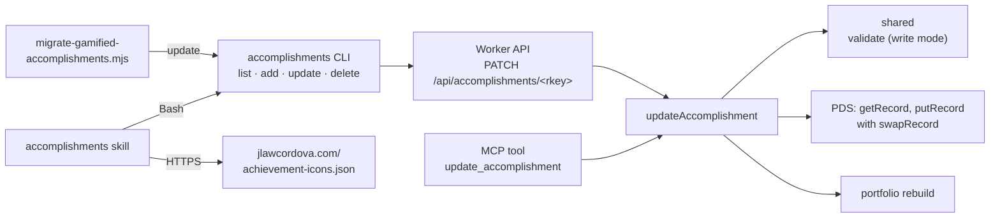

# Spec: Gamified accomplishments (records, Worker, CLI and skill)

> Status: Draft — Owner: J. Law Cordova — Date: 2026-10-03

Implements [`intent.md`](intent.md). Where they disagree, the intent wins and
this spec gets fixed. The contracts come from the
[parent spec](https://github.com/jlawcordova/jlawcordova.github.io/blob/main/docs/intents/2026-10-gamified-accomplishments/spec.md):
D1 (the record), D2 (`update`) and D7 (skill and migration). They are
referenced here, not copied. This spec adds what only this repo needs: the
details the parent leaves open, the acceptance tests and the build order.
Parent requirements are written "parent R10".

## 1. Components

## 2. Lexicon

`lexicons/com/jlawcordova/profile/accomplishment.json`, as parent D1:

- Add `funTitle` (string, at most 60 graphemes), `shortDescription` (string,
  at most 80 graphemes), `icon` (string, at most 32 graphemes, with
  `knownValues` listing the 16 IDs below) and `done` (boolean, `default: true`).
- Remove `startDate` from `required`. `title`, `description` and `createdAt`
  stay required.

The 16 icon IDs, in the order of the site's `src/lib/achievement-icons.mjs`
(merged in `jlawcordova.github.io#56`): `sprout`, `hammer`, `rocket`, `bug`,
`shield`, `key`, `wrench`, `book`, `magnifier`, `flask`, `apple`, `heart`,
`signpost`, `chest`, `trophy`, `speech`. `star` (the fallback) and `lock` are
not choices and aren't listed.

## 3. Validation (`shared`)

`validateAccomplishment(input, { mode })`, with `mode` either `"read"` (the
default, so existing callers don't change) or `"write"`.

Both modes, besides today's rules:

| Rule | Error field and message |
| --- | --- |
| `done`, if present, is a boolean | `done`: must be a boolean |
| `icon`, if present, is lowercase kebab-case (`^[a-z0-9]+(-[a-z0-9]+)*$`) | `icon`: must be lowercase kebab-case |
| `startDate` is required unless `done` is `false` | `startDate`: is required unless done is false |
| A locked record (`done: false`) has no `startDate` or `endDate` | `startDate` / `endDate`: must be absent while done is false |

Write mode only:

| Rule | Error field and message |
| --- | --- |
| `funTitle`, `shortDescription` and `icon` are present and not empty | `<field>`: is required |
| `funTitle` is one to three words | `funTitle`: must be one to three words |
| `shortDescription` is five to seven words | `shortDescription`: must be five to seven words |

- A word is a run of non-space characters after trimming, so "Bug Squasher"
  is two and "Mid-sprint save" is two.
- `funTitle` and `shortDescription` are trimmed like `title`.
- Unknown icon IDs pass. `knownValues` is advisory (intent, out of scope).
- `done` is kept as given. An absent `done` stays absent, which means done.

**Ordering.** `compareAccomplishments` today keys on `endDate ?? startDate`,
which a locked record doesn't have. Locked records sort **first**, newest
`createdAt` first, then done records as today. Putting them first means a
`--limit` never cuts them off, and the skill needs all of them for staleness.

**`list` filter.** `since` keeps comparing `endDate ?? startDate`. Locked
records are always included, whatever `since` is.

**Fixture.** `shared/test/fixtures/records-2026-10.json` holds today's real
records with their structure kept and their text replaced by invented text
(no private text in a commit). They must still validate in read mode and sort
as before.

## 4. Update (`jlawcordova-mcp`)

### 4.1 `updateAccomplishment(rkey, patch)` (`accomplishments.ts`)

1. Reject a malformed rkey (`bad_request`), as `deleteAccomplishment` does.
2. Reject a patch that isn't a non-empty object (`bad_request`, "Nothing to
   update.").
3. `getRecord`. Not found → `not_found`.
4. Merge: start from the stored record, set each patch field, and remove each
   field the patch sets to `null`. `$type` and `createdAt` in the patch are
   ignored, as `add` ignores them, so `createdAt` survives every update
   (staleness depends on it).
5. Validate the result in **write** mode. Failure → `invalid` with every error.
6. `putRecord` with the stored CID as `swapRecord`. A swap failure
   (`InvalidSwap`) → `conflict`. Other PDS failures → as `add` reports them.
7. Trigger the rebuild like `add`, and return the updated record with its rkey
   and the `rebuild` line.

Because step 5 uses write mode, an old record gets updated only once it has
all three new fields. The migration adds all three in one patch, so it passes.
Marking done is `{ "done": true, "startDate": "YYYY-MM" }`, and locking a done
one again is `{ "done": false, "startDate": null, "endDate": null }`.

`addAccomplishment` validates in write mode, and `ADD_FIELDS` gains
`funTitle`, `shortDescription`, `icon` and `done`.

### 4.2 `PATCH /api/accomplishments/<rkey>` (`api.ts`)

Same auth, body parsing and size limit as `POST`. The body's allowed fields
are `ADD_FIELDS` (unknown fields → 422, as `POST`).

| Result | Status |
| --- | --- |
| Updated | 200, body shaped like `POST`'s 201 |
| Malformed rkey, empty patch, non-JSON body | 400 |
| Unknown rkey | 404 |
| `conflict` | 409, "The record changed while updating. Try again." |
| Over 64 KiB | 413 |
| `invalid` | 422 with `errors` |

The item route's 405 message becomes "Use DELETE or PATCH." with
`Allow: DELETE, PATCH`.

### 4.3 MCP tools (`tools.ts`)

- `add_accomplishment` gains the four fields in its input schema and
  description.
- New `update_accomplishment` with `rkey` and `patch`, wrapping
  `updateAccomplishment`, worded and formatted like `add_accomplishment`.
- The output of `list_accomplishments` and `delete_accomplishment` doesn't
  change, apart from carrying the new fields when a record has them.

## 5. CLI (`jlawcordova-cli`)

- `accomplishments update <rkey>` reads the patch as JSON on stdin, sends it as
  the `PATCH` body unchanged and prints the 200 body. Empty stdin, a non-object
  or a missing rkey exits 2 and sends nothing. The rkey is URL-encoded.
- Exit codes are the existing ones: 404, 409 and 422 exit 1, with the error on
  stderr like `add`.
- Usage text and `docs/cli-setup.md` list `update`.
- Version 1.1.0 in `jlawcordova-cli/package.json`, released with the existing
  `cli-v<version>` workflow.

## 6. Skill (`.claude/skills/accomplishments/`)

`SKILL.md` and `README.md` change as parent D7 says: drafting with the three
new fields, the Stardew Valley voice, locked accomplishments, marking done,
stale cleanup and de-duplication against locked records. Details only this
repo decides:

- **Preflight** checks that `accomplishments --help` lists `update`. If not,
  it says to install CLI 1.1.0 from the latest release and stops.
- **Icons.** Fetch `https://jlawcordova.com/achievement-icons.json` once per
  run. If it can't be fetched, use the 16 IDs listed in the skill as a
  fallback and say so.
- **Selector.** Each draft option shows the fun title, the short description
  and the icon ID, then the plain title. Text typed under "Other" is shown in
  full and confirmed before saving, as today.
- **Stale.** Locked records whose `createdAt` is more than 14 days before now
  are listed in their own multi-select question ("Delete these stale goals?").
  Only the chosen ones are deleted.
- **Marking done** is an `update` with `done: true` and the month, after I
  pick it in the selector. It never happens without my choice.
- **Permissions.** `.claude/settings.json` doesn't change: `list` stays the
  only allowlisted command, so `update` prompts like `add` and `delete`.
- **Ordering with the site.** Until the site's PR 3 ships, the old fetch
  script drops records without a `startDate`, so a locked record won't show on
  the site yet. Nothing breaks, so the skill doesn't need to wait.

## 7. Migration (`scripts/migrate-gamified-accomplishments.mjs`)

As parent D7, with these details:

- **Input.** `node scripts/migrate-gamified-accomplishments.mjs <approved.json>
  [--write]`. The file maps each rkey to
  `{ funTitle, shortDescription, icon }`. Claude writes it in the scratchpad
  from the selector answers I approved. It is never committed.
- **Dry run** (the default). It runs `accomplishments list --limit 100`, and for
  each record prints the rkey, the plain title and the three fields it would
  add, or why it would skip: it already has a `funTitle`, or it isn't in the
  file. It also lists rkeys in the file that don't exist. It writes nothing.
- **`--write`.** For each record it would update, it runs
  `accomplishments update <rkey>` with exactly the three fields, one at a time,
  and stops at the first failure with the rkey and the error. Rerunning it
  skips what's done.
- **Test.** `scripts/migrate-gamified-accomplishments.test.mjs`, run with
  `node --test "scripts/*.test.mjs"` (Node 22 reads a bare `scripts/` as a
  module path), drives the script with a fake `accomplishments` on `PATH`. The root `npm test` runs workspaces only, so the PR's Verification
  section shows this command separately.
- Both files are deleted in a clean-up commit after the run.

## 8. Acceptance tests

### Records and validation (`shared`)

| # | Test |
| --- | --- |
| V1 | The Lexicon has the four new properties with the limits in §2, the 16 `knownValues`, and `startDate` not in `required` |
| V2 | Every record in the fixture validates in read mode, unchanged, and sorts in the same order as before |
| V3 | A record with no `startDate` is valid only when `done` is `false` |
| V4 | A locked record with a `startDate` or `endDate` fails, naming the field |
| V5 | Write mode: a record missing `funTitle`, `shortDescription` or `icon` fails with each missing one listed; read mode accepts it |
| V6 | Write mode: `funTitle` of 0 or 4 words fails, 1 and 3 pass; `shortDescription` of 4 or 8 words fails, 5 and 7 pass |
| V7 | `icon` that isn't kebab-case fails in both modes; an unknown kebab-case ID passes |
| V8 | `done` that isn't a boolean fails; an absent `done` stays absent and the record counts as done |
| V9 | Locked records sort first, newest `createdAt` first, then done records as before |
| V10 | `list` with `since` still returns every locked record |

### Update (Worker and MCP)

| # | Test |
| --- | --- |
| U1 | A one-field patch changes that field and leaves every other field, `createdAt` and the rkey byte-for-byte equal |
| U2 | A field set to `null` is removed; `$type` and `createdAt` in the patch are ignored |
| U3 | `putRecord` is called with the stored CID as `swapRecord`; a swap failure → 409 and nothing else is written |
| U4 | A merged record that fails write mode → 422 with every error; nothing written |
| U5 | Unknown rkey → 404; malformed rkey, empty patch or non-JSON body → 400; over 64 KiB → 413 |
| U6 | Mark done (`done: true` and a `startDate`) and re-lock (`done: false`, dates `null`) both succeed |
| U7 | Adding the three fields to an old-style record (no `done`, no new fields) succeeds, which is the migration's case |
| U8 | A successful update triggers the rebuild; a failed trigger doesn't fail the update and `rebuild` starts with `failed:` |
| U9 | Auth on `PATCH` is the same as the other routes: no token 401, another user 403, nothing written |
| U10 | The item route's 405 lists `DELETE, PATCH` in `Allow` |
| U11 | `POST` and `add_accomplishment` accept the new fields and require them (write mode) |
| U12 | `update_accomplishment` gives the same result as `PATCH` for the same input |
| U13 | Every existing test in `tools.test.ts`, `api.test.ts`, `session.test.ts` and `oauth.test.ts` passes, with edits only where a record now needs the new fields |

### CLI

| # | Test |
| --- | --- |
| C1 | `update <rkey>` sends stdin unchanged as the `PATCH` body to the URL-encoded rkey and prints the 200 body |
| C2 | `update` with no rkey, empty stdin or a non-object exits 2 and sends nothing |
| C3 | 404, 409 and 422 exit 1 with the error on stderr and nothing on stdout |
| C4 | Usage text lists `update`, and `--help` still exits 2 |
| C5 | The release tarball for 1.1.0 installs and `accomplishments --help` lists `update` |

### Skill and migration

| # | Test |
| --- | --- |
| S1 | A drafting run shows each draft with a fun title (1 to 3 words), a short description (5 to 7 words) and an icon from the list, and saves only what I pick (parent R4, R15) |
| S2 | Sample drafts attached to the PR read in the Stardew Valley voice, with no joke that needs explaining and nothing overstated (parent R18) |
| S3 | "Add a goal: …" drafts a locked record with no dates and saves it only after I approve (parent R11) |
| S4 | A run lists a locked record older than 14 days in its own question and deletes only what I choose (parent R10) |
| S5 | A run where recent work matches a locked record offers to mark it done, and does it with `update` only when chosen (parent R11) |
| S6 | With the CLI at 1.0.0, preflight says to install 1.1.0 and stops |
| M1 | The dry run prints each record's planned fields or skip reason, lists unknown rkeys, and writes nothing |
| M2 | `--write` sends exactly the three fields per record, skips records with a `funTitle`, and a rerun writes nothing |
| M3 | `--write` stops at the first failure and names the rkey |
| M4 | After the real run, `accomplishments list --limit 100` shows every record with the three fields, and every other field equal to before (parent R16) |

### Deploy

| # | Test |
| --- | --- |
| D1 | After the Worker deploy, `accomplishments list --limit 100` returns the same records as before it, and the site's next build shows the same count |
| D2 | `accomplishments update` on a throwaway record changes one field and leaves the rest equal; the record is then deleted |

## 9. Build order

One PR, one commit per step. Each step ends green (`npm test`,
`npm run typecheck`) before the next.

1. **Lexicon and `shared`.** The new properties, read and write modes,
   ordering, the fixture and a test per rule. *Passes: V1 to V9.*
2. **`list` and `add`.** The `since` rule, the new fields in `ADD_FIELDS` and
   `add_accomplishment`, write mode on `add`. *Passes: V10, U11, U13.*
3. **`update` in the Worker.** `updateAccomplishment`, the `PATCH` route and
   the 405 change, with `swapRecord` in `fake-network.ts`. *Passes: U1 to U10.*
4. **`update_accomplishment` tool.** *Passes: U12, U13.*
5. **CLI `update`.** The command, usage, `docs/cli-setup.md` and version
   1.1.0. *Passes: C1 to C4.*
6. **Skill.** `SKILL.md` and `README.md`, with sample drafts in the PR.
   *Passes: S2 (review); S1, S3 to S6 after step 8.*
7. **Migration script.** The script and its test. *Passes: M1 to M3.*
8. **Merge, deploy and release** (ask first). Merging deploys the Worker.
   Then push `cli-v1.1.0` and install from the release. *Passes: D1, D2, C5,
   then S1, S3 to S6 in a real run.*
9. **Run the migration** (ask first). Draft the suggestions, I approve them
   in the selector, review the dry run, then `--write` once. *Passes: M4.*
10. **Clean up and close.** Delete the migration script and its test, mark
    this intent and spec **Closed**, update the index, and tell the site repo
    to set its intent to done.
