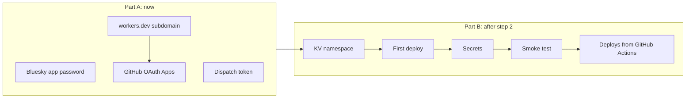

# Setup: accounts, secrets, and deploy

The manual setup behind step 3 of the build order in [`spec.md`](../spec.md)
§8: the KV namespace, the deploy, and the secrets and OAuth Apps. Part A
needs no code and can be done now. Part B needs the Worker from step 2.

Each credential below is shown once when it's created. Save it straight to a
password manager and don't paste it anywhere else: not into chat, an issue,
or a file that's tracked by git.



## Part A: credentials (no code needed)

There's no cookie-signing key to generate. The OAuth provider binds the
consent page and the GitHub `state` to the browser with its own cookies
(spec §4.1).

### A1. Bluesky app password

For `BSKY_APP_PASSWORD`. Sign in to bsky.app as `jlawcordova.com`.

1. Go to **Settings → Privacy and security → App passwords → Add App
   Password**.
2. Name it `jlawcordova-mcp`. Leave **Allow access to your direct messages**
   off.
3. Copy the password (`xxxx-xxxx-xxxx-xxxx`).

The account it belongs to, `BSKY_IDENTIFIER`, is a var in `wrangler.jsonc`
that's already set to `jlawcordova.com`. Never use the account's main
password. An app password can be revoked on its own, and it can't change the
account's email, password, or handle.

### A2. Rebuild dispatch token

`GH_DISPATCH_TOKEN` lets the Worker send `repository_dispatch` to the
portfolio repo, and nothing else.

1. Go to <https://github.com/settings/personal-access-tokens/new>
   (fine-grained token).
2. **Name:** `jlawcordova-mcp dispatch`. **Resource owner:** `jlawcordova`.
3. **Expiration:** your choice. Put the date in your calendar, because when
   the token expires only the rebuild breaks, and quietly: tools report
   `rebuild: failed` and the daily build covers it.
4. **Repository access:** *Only select repositories* →
   `jlawcordova/jlawcordova.github.io`.
5. **Permissions → Repository permissions → Contents: Read and write.**
   GitHub adds Metadata: Read-only on its own. Add nothing else.
6. Generate the token and copy it.

Check it. The portfolio has no workflow listening for `atproto-updated` until
step 4, so this changes nothing. It should print `204`:

```sh
read -rs GH_DISPATCH_TOKEN && export GH_DISPATCH_TOKEN
curl -s -o /dev/null -w '%{http_code}\n' -X POST \
  -H "Authorization: Bearer $GH_DISPATCH_TOKEN" \
  -H "Accept: application/vnd.github+json" \
  -H "X-GitHub-Api-Version: 2022-11-28" \
  https://api.github.com/repos/jlawcordova/jlawcordova.github.io/dispatches \
  -d '{"event_type":"atproto-updated"}'
```

`read -rs` keeps the token out of your shell history.

### A3. workers.dev subdomain

The production callback URL is
`https://jlawcordova-mcp.<account-subdomain>.workers.dev/callback`, so find the
subdomain before creating the OAuth App. In the Cloudflare dashboard, open
**Workers & Pages**. The account's `*.workers.dev` subdomain is shown there;
if none is set up yet, the dashboard asks you to pick one.

If you'd rather use a custom domain such as `mcp.jlawcordova.com`, decide now:
the callback URL depends on it.

### A4. GitHub OAuth Apps (two)

One OAuth App holds one callback URL, so production and local dev each get
their own app. Go to <https://github.com/settings/developers> → **OAuth Apps →
New OAuth App**.

| Field | Production | Local dev |
| --- | --- | --- |
| Application name | `jlawcordova-mcp` | `jlawcordova-mcp (dev)` |
| Homepage URL | `https://jlawcordova.com` | `https://jlawcordova.com` |
| Authorization callback URL | `https://jlawcordova-mcp.<account-subdomain>.workers.dev/callback` | `http://localhost:8788/callback` |
| Enable Device Flow | off | off |

For each app, click **Generate a new client secret** and save the secret as
`GITHUB_CLIENT_SECRET`. The **Client ID** isn't secret, because it appears in
every sign-in URL:

- **Production:** the client ID is the `GITHUB_CLIENT_ID` var in
  `wrangler.jsonc`. If you create a new production app, update it there and
  deploy.
- **Local dev:** the client ID goes in `.dev.vars` (A5) and overrides the
  production value.

The Worker asks GitHub for no scopes, so signing in only shares your public
profile. Who gets in is decided by the owner check (§4.4), not by the app.

### A5. Local `.dev.vars`

Copy `jlawcordova-mcp/.dev.vars.example` to `jlawcordova-mcp/.dev.vars` and
fill it in with the **dev** OAuth App. `.dev.vars` is already git-ignored.

```sh
GITHUB_CLIENT_ID=...
GITHUB_CLIENT_SECRET=...
BSKY_APP_PASSWORD=...
GH_DISPATCH_TOKEN=...
PUBLIC_URL=http://localhost:8788
```

`GITHUB_CLIENT_ID` and `PUBLIC_URL` override the production values in
`wrangler.jsonc`. The other vars come from `wrangler.jsonc` as they are.

## Part B: Cloudflare (needs the step 2 Worker)

Run these from `jlawcordova-mcp/`. Sign in once with `npx wrangler login`, and
check the account with `npx wrangler whoami`.

### B1. KV namespace

Create a namespace titled exactly `jlawcordova-mcp-session`. In the dashboard
that's **Storage & databases → KV → Create**; Claude can also create it
through the Cloudflare connector once you approve. Then put its ID in
`wrangler.jsonc` (it's already there for the current namespace):

```jsonc
"kv_namespaces": [
  { "binding": "OAUTH_KV", "id": "<namespace id>" }
]
```

The binding name stays `OAUTH_KV`, because that's the name the OAuth provider
looks for.

### B2. First deploy

```sh
npx wrangler deploy
```

The output prints the Worker's URL. Check that:

- it matches the callback URL in the production OAuth App (A4), and fix the
  app if it doesn't;
- it matches `PUBLIC_URL` in `wrangler.jsonc`, with no trailing slash. If it
  doesn't, update `PUBLIC_URL` and deploy again. The OAuth provider uses it as
  the issuer and resource, and the GitHub redirect is built from it.

Until B3 is done the Worker runs, but sign-in and tools fail because the
secrets are missing.

### B3. Production secrets

Each command prompts for the value, so the value stays out of your shell
history. Use the **production** OAuth App.

```sh
npx wrangler secret put GITHUB_CLIENT_SECRET
npx wrangler secret put BSKY_APP_PASSWORD
npx wrangler secret put GH_DISPATCH_TOKEN
npx wrangler secret list
```

`secret list` should show exactly these three names. It never shows values.
Secrets take effect immediately; there's no need to deploy again.

The vars (`ALLOWED_GITHUB_USER_ID`, `ALLOWED_GITHUB_LOGIN`, `ATPROTO_HANDLE`,
`BSKY_IDENTIFIER`, `GITHUB_CLIENT_ID`, `PORTFOLIO_REPO`, `PUBLIC_URL`) live in
`wrangler.jsonc` and are deployed with the code. Don't set them as secrets.

If you followed an earlier version of this guide, `secret list` may also show
`GITHUB_CLIENT_ID`, `BSKY_IDENTIFIER`, or `COOKIE_ENCRYPTION_KEY`. Delete
them: a secret and a var can't share a name, and the Worker no longer reads
the cookie key.

```sh
npx wrangler secret delete GITHUB_CLIENT_ID
npx wrangler secret delete BSKY_IDENTIFIER
npx wrangler secret delete COOKIE_ENCRYPTION_KEY
```

### B4. Smoke test

1. `curl -i https://jlawcordova-mcp.<account-subdomain>.workers.dev/mcp`
   returns `401` (M1).
2. `https://jlawcordova-mcp.<account-subdomain>.workers.dev/.well-known/oauth-authorization-server`
   returns JSON metadata.
3. In Claude, add a custom connector with the `/mcp` URL and sign in with
   GitHub as `jlawcordova`. `list_accomplishments` should return no items.
4. Sign in with any other GitHub account: it's refused with `403` (E4).

Adding and deleting a real record is E1–E3, after the portfolio PR (step 4).

### B5. Deploys from GitHub Actions

After the first deploy, `.github/workflows/deploy-mcp.yml` deploys the Worker
on every push to `main` that touches it (`jlawcordova-mcp/`, `shared/`,
`lexicons/`, or the root npm files). It can also be run by hand from the
**Actions** tab. Pull requests run the tests and a dry-run bundle but don't
deploy.

The workflow needs one repository secret, `CLOUDFLARE_API_TOKEN`:

1. In the Cloudflare dashboard, go to **My Profile → API Tokens → Create
   Token** and use the **Edit Cloudflare Workers** template.
2. Limit **Account Resources** and **Zone Resources** to your own account.
3. Create the token and copy it.
4. In GitHub, go to `jlawcordova/jlawcordova-atproto` → **Settings → Secrets
   and variables → Actions → New repository secret**. Name it
   `CLOUDFLARE_API_TOKEN` and paste the token.

A deploy uploads the code and the vars in `wrangler.jsonc`. It doesn't touch
the secrets from B3.

## Rotating a credential

| Credential | Revoke at | Then |
| --- | --- | --- |
| Bluesky app password | bsky.app → App passwords | New one, `wrangler secret put BSKY_APP_PASSWORD`. The stored session stops refreshing and the Worker signs in again with the new password (§4.5) |
| Dispatch token | GitHub → Settings → Personal access tokens | New one, `wrangler secret put GH_DISPATCH_TOKEN` |
| OAuth client secret | GitHub → Settings → Developer settings → OAuth Apps | New one, `wrangler secret put GITHUB_CLIENT_SECRET` |
| Cloudflare API token | Cloudflare → My Profile → API Tokens | New one, then update the `CLOUDFLARE_API_TOKEN` repository secret (B5) |
