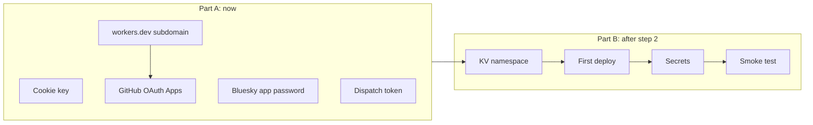

# Setup: accounts, secrets, and deploy

The manual setup behind step 3 of the build order in [`spec.md`](../spec.md)
§8: the KV namespace, the deploy, and the secrets and OAuth Apps. Part A
needs no code and can be done now. Part B needs the Worker from step 2.

Each credential below is shown once when it's created. Save it straight to a
password manager and don't paste it anywhere else: not into chat, an issue,
or a file that's tracked by git.



## Part A: credentials (no code needed)

### A1. Cookie encryption key

`COOKIE_ENCRYPTION_KEY` is 32 random bytes, hex encoded:

```sh
openssl rand -hex 32
```

Generate one for production and a different one for `.dev.vars`.

### A2. Bluesky app password

For `BSKY_APP_PASSWORD`. Sign in to bsky.app as `jlawcordova.com`.

1. Go to **Settings → Privacy and security → App passwords → Add App
   Password**.
2. Name it `jlawcordova-mcp`. Leave **Allow access to your direct messages**
   off.
3. Copy the password (`xxxx-xxxx-xxxx-xxxx`).

`BSKY_IDENTIFIER` is `jlawcordova.com`. Never use the account's main
password. An app password can be revoked on its own, and it can't change the
account's email, password, or handle.

### A3. Rebuild dispatch token

`GH_DISPATCH_TOKEN` lets the Worker send `repository_dispatch` to the
portfolio repo, and nothing else.

1. Go to <https://github.com/settings/personal-access-tokens/new>
   (fine-grained token).
2. **Name:** `jlawcordova-mcp dispatch`. **Resource owner:** `jlawcordova`.
3. **Expiration:** your choice. Put the date in your calendar, because when
   the token expires only the rebuild breaks, and quietly: tools report
   `rebuild: failed` and the daily build covers it.
4. **Repository access:** *Only select repositories* →
   `jlawcordova/jlawcordova.github.io`.
5. **Permissions → Repository permissions → Contents: Read and write.**
   GitHub adds Metadata: Read-only on its own. Add nothing else.
6. Generate the token and copy it.

Check it. The portfolio has no workflow listening for `atproto-updated` until
step 4, so this changes nothing. It should print `204`:

```sh
read -rs GH_DISPATCH_TOKEN && export GH_DISPATCH_TOKEN
curl -s -o /dev/null -w '%{http_code}\n' -X POST \
  -H "Authorization: Bearer $GH_DISPATCH_TOKEN" \
  -H "Accept: application/vnd.github+json" \
  -H "X-GitHub-Api-Version: 2022-11-28" \
  https://api.github.com/repos/jlawcordova/jlawcordova.github.io/dispatches \
  -d '{"event_type":"atproto-updated"}'
```

`read -rs` keeps the token out of your shell history.

### A4. workers.dev subdomain

The production callback URL is
`https://jlawcordova-mcp.<account-subdomain>.workers.dev/callback`, so find the
subdomain before creating the OAuth App. In the Cloudflare dashboard, open
**Workers & Pages**. The account's `*.workers.dev` subdomain is shown there;
if none is set up yet, the dashboard asks you to pick one.

If you'd rather use a custom domain such as `mcp.jlawcordova.com`, decide now:
the callback URL depends on it.

### A5. GitHub OAuth Apps (two)

One OAuth App holds one callback URL, so production and local dev each get
their own app. Go to <https://github.com/settings/developers> → **OAuth Apps →
New OAuth App**.

| Field | Production | Local dev |
| --- | --- | --- |
| Application name | `jlawcordova-mcp` | `jlawcordova-mcp (dev)` |
| Homepage URL | `https://jlawcordova.com` | `https://jlawcordova.com` |
| Authorization callback URL | `https://jlawcordova-mcp.<account-subdomain>.workers.dev/callback` | `http://localhost:8788/callback` |
| Enable Device Flow | off | off |

For each app, click **Generate a new client secret**, then save the
**Client ID** and the secret as `GITHUB_CLIENT_ID` and `GITHUB_CLIENT_SECRET`.

The Worker asks GitHub for no scopes, so signing in only shares your public
profile. Who gets in is decided by the owner check (§4.4), not by the app.

### A6. Local `.dev.vars`

Once step 2 adds `jlawcordova-mcp/`, create `jlawcordova-mcp/.dev.vars` with
the **dev** OAuth App and the dev cookie key. `.dev.vars` is already
git-ignored.

```sh
GITHUB_CLIENT_ID=...
GITHUB_CLIENT_SECRET=...
COOKIE_ENCRYPTION_KEY=...
BSKY_IDENTIFIER=jlawcordova.com
BSKY_APP_PASSWORD=...
GH_DISPATCH_TOKEN=...
```

## Part B: Cloudflare (needs the step 2 Worker)

Run these from `jlawcordova-mcp/`. Sign in once with `npx wrangler login`, and
check the account with `npx wrangler whoami`.

### B1. KV namespace

Create a namespace titled exactly `jlawcordova-mcp-session`. In the dashboard
that's **Storage & databases → KV → Create**; Claude can also create it
through the Cloudflare connector once you approve. Then put its ID in
`wrangler.jsonc`:

```jsonc
"kv_namespaces": [
  { "binding": "OAUTH_KV", "id": "<namespace id>" }
]
```

The binding name stays `OAUTH_KV`, because that's the name the OAuth provider
looks for.

### B2. First deploy

```sh
npx wrangler deploy
```

The output prints the Worker's URL. Check that it matches the callback URL in
the production OAuth App (A5), and fix the app if it doesn't. Until B3 is done
the Worker runs, but sign-in and tools fail because the secrets are missing.

### B3. Production secrets

Each command prompts for the value, so the value stays out of your shell
history. Use the **production** OAuth App and the production cookie key.

```sh
npx wrangler secret put GITHUB_CLIENT_ID
npx wrangler secret put GITHUB_CLIENT_SECRET
npx wrangler secret put COOKIE_ENCRYPTION_KEY
npx wrangler secret put BSKY_IDENTIFIER
npx wrangler secret put BSKY_APP_PASSWORD
npx wrangler secret put GH_DISPATCH_TOKEN
npx wrangler secret list
```

`secret list` should show all six names. It never shows values. Secrets take
effect immediately; there's no need to deploy again.

The vars (`ALLOWED_GITHUB_USER_ID`, `ALLOWED_GITHUB_LOGIN`, `ATPROTO_HANDLE`,
`PORTFOLIO_REPO`) live in `wrangler.jsonc` and are deployed with the code.
Don't set them as secrets.

### B4. Smoke test

1. `curl -i https://jlawcordova-mcp.<account-subdomain>.workers.dev/mcp`
   returns `401` (M1).
2. `https://jlawcordova-mcp.<account-subdomain>.workers.dev/.well-known/oauth-authorization-server`
   returns JSON metadata.
3. In Claude, add a custom connector with the `/mcp` URL and sign in with
   GitHub as `jlawcordova`. `list_accomplishments` should return no items.
4. Sign in with any other GitHub account: it's refused with `403` (E4).

Adding and deleting a real record is E1–E3, after the portfolio PR (step 4).

## Rotating a credential

| Credential | Revoke at | Then |
| --- | --- | --- |
| Bluesky app password | bsky.app → App passwords | New one, `wrangler secret put BSKY_APP_PASSWORD`. The stored session stops refreshing and the Worker signs in again with the new password (§4.5) |
| Dispatch token | GitHub → Settings → Personal access tokens | New one, `wrangler secret put GH_DISPATCH_TOKEN` |
| OAuth client secret | GitHub → Settings → Developer settings → OAuth Apps | New one, `wrangler secret put GITHUB_CLIENT_SECRET` |
| Cookie key | n/a | New one, `wrangler secret put COOKIE_ENCRYPTION_KEY`; the next sign-in shows the approval dialog again |
