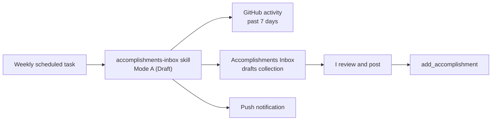

# Weekly task prompt: draft accomplishments

> First built for [`spec.md`](intents/2026-10-kickoff/spec.md) §6 (build order
> step 5). Since then, drafts go to an inbox artifact for review, and the
> drafting rules live in a skill.

A prompt for a weekly scheduled task in the Claude app. Each run reviews my
GitHub activity from the past 7 days and writes drafts to my private
**Accomplishments Inbox** artifact. I review and post them from the inbox
myself. The task never posts anything.

The prompt stays short on purpose. What to gather, the description style, the
public-safety rules, how to write drafts to the inbox, and when to notify me
all live in the `accomplishments-inbox` skill, so they're changed in one place.
The skill's source is in this repo; after changing it, reinstall it in
claude.ai (see its
[README](../.claude/skills/accomplishments-inbox/README.md#install)).



## Setup

The skill's [README](../.claude/skills/accomplishments-inbox/README.md) covers
installing it, when each mode is used, and setting up the inbox and the
**Weekly accomplishments draft** task (Mondays 8:50 AM Manila time,
`CRON_TZ=Asia/Manila 50 8 * * 1`). To create the task by hand, paste the
prompt below with `<INBOX_URL>` replaced by the inbox's URL. If the task
already exists, update its prompt instead.

## Prompt

```text
Draft this week's career accomplishments into my Accomplishments Inbox:
<INBOX_URL>

Start by invoking the skill `anthropic-skills:accomplishments-inbox` with the
Skill tool (it may also be listed as just `accomplishments-inbox`), with args
"Mode A (Draft), inbox <the URL above>". Follow its Mode A instructions
exactly. They cover what to gather from GitHub, the description style, the
public-safety rules, how to write the drafts to the inbox, and when to notify
me. Don't draft from memory or from this prompt alone.

If neither skill name is listed in this session, don't draft anything. Send
me a push notification saying the weekly accomplishments run couldn't find
the accomplishments-inbox skill, and stop.
```
