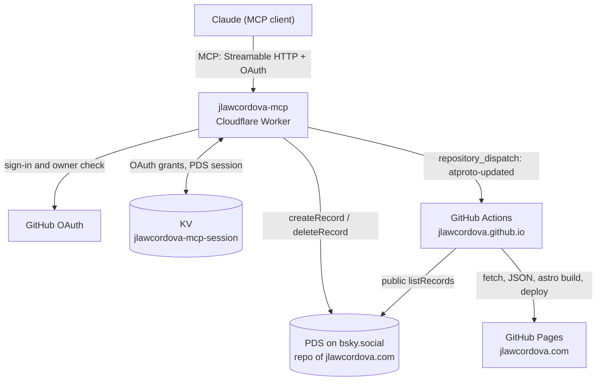

# Spec: Accomplishments on AT Protocol

> Status: v0.2 — Owner: J. Law Cordova — Date: 2026-10-01 — Implements
> [`intent.md`](intent.md) v0.3

This spec turns the intent into contracts that can be built and tested. Where
it and the intent disagree, the intent wins and this file gets fixed.

## 1. Components



| Component | Location | Owns |
| --- | --- | --- |
| Lexicon | `lexicons/com/jlawcordova/profile/accomplishment.json` | Record schema |
| Shared validator | `shared/` (npm workspace `@jlawcordova/accomplishment`) | Record validation, `YYYY-MM` rules, sort order |
| MCP server | `jlawcordova-mcp/` | OAuth, tools, PDS session, rebuild trigger |
| Weekly prompt | `docs/weekly-task-prompt.md` | Drafting accomplishments for approval |
| Portfolio | `jlawcordova/jlawcordova.github.io` | Fetch script, Accomplishments section, workflow |

## 2. Lexicon

NSID `com.jlawcordova.profile.accomplishment`, record key `tid`. The NSID
authority is `profile.jlawcordova.com`. Publishing the schema through
`_lexicon.profile.jlawcordova.com` is optional and not part of v1.

```json
{
  "lexicon": 1,
  "id": "com.jlawcordova.profile.accomplishment",
  "defs": {
    "main": {
      "type": "record",
      "key": "tid",
      "description": "A single career accomplishment. Records are public.",
      "record": {
        "type": "object",
        "required": ["title", "description", "startDate", "createdAt"],
        "properties": {
          "title": {
            "type": "string",
            "maxLength": 2000,
            "maxGraphemes": 200,
            "description": "Short headline of the accomplishment."
          },
          "description": {
            "type": "string",
            "maxLength": 10000,
            "maxGraphemes": 1000,
            "description": "What was done and its impact, impact first."
          },
          "startDate": {
            "type": "string",
            "minLength": 7,
            "maxLength": 7,
            "description": "Month it started or happened, as YYYY-MM."
          },
          "endDate": {
            "type": "string",
            "minLength": 7,
            "maxLength": 7,
            "description": "Month it finished, as YYYY-MM. Not before startDate. Omit if ongoing or a single month."
          },
          "tags": {
            "type": "array",
            "maxLength": 10,
            "items": { "type": "string", "maxLength": 640, "maxGraphemes": 64 },
            "description": "Skills, technologies, or themes."
          },
          "links": {
            "type": "array",
            "maxLength": 10,
            "items": { "type": "string", "format": "uri" },
            "description": "Evidence such as PRs, articles, demos, or press. http or https only."
          },
          "createdAt": {
            "type": "string",
            "format": "datetime",
            "description": "When the record was created."
          }
        }
      }
    }
  }
}
```

`maxLength` is in UTF-8 bytes and set to 10× the grapheme limit, the usual
atproto convention, so the grapheme limit is the one that binds in practice.

## 3. Shared validator

Package `@jlawcordova/accomplishment` in `shared/`, imported by the Worker.

### 3.1 API

```ts
export const NSID = "com.jlawcordova.profile.accomplishment";

export interface Accomplishment {
  $type?: typeof NSID;
  title: string;
  description: string;
  startDate: string;   // YYYY-MM
  endDate?: string;    // YYYY-MM
  tags?: string[];
  links?: string[];
  createdAt: string;   // RFC 3339
}

export type ValidationResult =
  | { ok: true; value: Accomplishment }
  | { ok: false; errors: { field: string; message: string }[] };

export function validateAccomplishment(input: unknown): ValidationResult;
export function compareAccomplishments(a: Accomplishment, b: Accomplishment): number;
```

### 3.2 Rules

1. **Schema rules** come from the Lexicon JSON itself, through
   `@atproto/lexicon`'s `Lexicons.assertValidRecord`. The JSON stays the single
   source of truth for types, required fields, and lengths.
2. **Extra rules** the Lexicon can't express:
   - `startDate` and `endDate` match `^\d{4}-(0[1-9]|1[0-2])$`, with the year
     from 1970 to 2100.
   - `endDate`, when present, is not before `startDate`.
   - Every link is an absolute `http:` or `https:` URL. Other schemes,
     including `javascript:` and `data:`, are rejected.
   - `title` and `description` are not empty after trimming.
   - Tags are trimmed, empty tags are rejected, and duplicates are rejected
     case-insensitively.
3. **No normalization surprises.** The validator returns the value as given,
   apart from trimming `title`, `description`, and tags. It never invents
   fields; the Worker sets `createdAt` before validating.
4. Errors name the field (`links[2]`, `endDate`) and say what's wrong in plain
   words, because Claude relays them to me.

If `@atproto/lexicon` won't bundle cleanly for Workers, rule 1 is reimplemented
by hand, and a test asserts that the hand-written limits match the Lexicon JSON.

### 3.3 Sort order

`compareAccomplishments` sorts newest first: by `endDate ?? startDate`
descending, then `createdAt` descending. `YYYY-MM` strings compare correctly as
plain strings.

## 4. MCP server (`jlawcordova-mcp`)

### 4.1 Stack

| Piece | Choice |
| --- | --- |
| Runtime | Cloudflare Workers, Worker name `jlawcordova-mcp` |
| MCP | `createMcpHandler` from `agents/mcp/server`, MCP SDK v2 (`@modelcontextprotocol/server`), Streamable HTTP at `/mcp` |
| OAuth | `@cloudflare/workers-oauth-provider`, GitHub as the upstream identity provider |
| atproto | `@atproto/api` |
| Validation | `@jlawcordova/accomplishment` (workspace) and `zod` for tool inputs |
| Tests | `vitest` with `@cloudflare/vitest-pool-workers` |

Exact versions are checked against current docs and npm at implementation time
and pinned exactly (no `^` or `~`) in `package.json`, with the lockfile
committed. A new `McpServer` is created for each request, as the SDK requires
for stateless servers.

Version constraints found at implementation time (v0.2):

- `@modelcontextprotocol/server` is pinned to `2.0.0`, the version `agents`
  0.24.0 peers on.
- `vitest` is `4.1.x` in every workspace, because
  `@cloudflare/vitest-pool-workers` 0.22 requires `^4.1`.
- The repo's `.npmrc` sets `legacy-peer-deps=true`: npm 10's resolver crashes
  on this dependency tree. The required peers of `agents` that the Worker
  actually loads are listed as direct dependencies instead.
- `@cloudflare/workers-oauth-provider` 1.2 ships the consent and upstream
  sign-in helpers (`beginConsent`, `approveConsent`, `beginUpstream`,
  `finishUpstream`). They bind the consent page and the GitHub `state` to the
  browser with their own cookies, so no cookie-signing secret is needed.
  Dynamic client registration is on (Client ID Metadata Documents are not).

### 4.2 Configuration

**KV:** one namespace titled `jlawcordova-mcp-session`, bound as `OAUTH_KV`
(the binding name the OAuth provider expects). It holds OAuth clients, grants,
and tokens (managed by the provider) and the PDS session under the key
`atproto:session:v1`.

**Secrets** (set with `wrangler secret put`, never committed or logged):

| Name | Purpose |
| --- | --- |
| `GITHUB_CLIENT_SECRET` | GitHub OAuth App client secret |
| `BSKY_APP_PASSWORD` | Bluesky app password for this server only |
| `GH_DISPATCH_TOKEN` | Fine-grained PAT, repo `jlawcordova/jlawcordova.github.io` only, Contents: read and write |

**Vars** (in `wrangler.jsonc`, not secret):

| Name | Value |
| --- | --- |
| `ALLOWED_GITHUB_USER_ID` | `21234671` |
| `ALLOWED_GITHUB_LOGIN` | `jlawcordova` |
| `ATPROTO_HANDLE` | `jlawcordova.com` |
| `BSKY_IDENTIFIER` | `jlawcordova.com` |
| `GITHUB_CLIENT_ID` | Production GitHub OAuth App client ID (public: it appears in every sign-in URL) |
| `PORTFOLIO_REPO` | `jlawcordova/jlawcordova.github.io` |
| `PUBLIC_URL` | The Worker's public origin, no trailing slash. `http://localhost:8788` in the file; set to the `workers.dev` URL (or custom domain) after the first deploy. The OAuth provider needs it as the canonical resource and issuer, so it can't be inferred from a request |

Local dev uses `.dev.vars` (git-ignored) with a separate GitHub OAuth App whose
callback is `http://localhost:8788/callback`; its `GITHUB_CLIENT_ID` and
`PUBLIC_URL` there override the values in `wrangler.jsonc`.

### 4.3 Routes

| Route | Handled by | Purpose |
| --- | --- | --- |
| `/mcp` | OAuth provider → `createMcpHandler` | MCP endpoint; requires a valid access token |
| `/authorize` | GitHub handler | Shows the approval dialog, then redirects to GitHub |
| `/callback` | GitHub handler | GitHub's redirect target; enforces the owner check |
| `/token` | OAuth provider | Token exchange |
| `/register` | OAuth provider | Dynamic client registration |
| `/.well-known/oauth-authorization-server` | OAuth provider | Metadata |

Production callback URL to register in the GitHub OAuth App:
`https://jlawcordova-mcp.<account-subdomain>.workers.dev/callback`. The exact
URL is known after the first deploy, or when a custom domain is chosen.

### 4.4 Auth and the owner check

1. The client registers dynamically and starts OAuth at `/authorize`. Anyone
   can register a client; registration grants nothing by itself.
2. The Worker redirects to GitHub with an empty scope (public profile only) and
   a `state` value tied to the request.
3. At `/callback` the Worker exchanges the code, calls `GET
   https://api.github.com/user`, and checks **both** `id === 21234671` and
   `login === "jlawcordova"` (case-insensitive). The ID is what makes it safe
   if the username is ever renamed and reclaimed; the login check is a guard
   against a typo in the configured ID.
4. On a mismatch it returns `403` with a generic message, issues no grant, and
   logs only `owner check failed` (no tokens, no other user's details).
5. On a match it completes the authorization with props `{ githubId, login }`.
   The GitHub access token is not stored; it isn't needed after the check.
6. **Defense in depth:** every tool handler reads `getMcpAuthContext()` and
   refuses with an error if `props.githubId` isn't the allowed ID.

### 4.5 PDS session

Writes go to the PDS through `AtpAgent` from `@atproto/api`, signed in with the
app password.

1. **Resolve the PDS.** `com.atproto.identity.resolveHandle` for
   `ATPROTO_HANDLE`, asked of `https://public.api.bsky.app`, gives the DID. The DID document (from `plc.directory` for
   `did:plc`) gives the `#atproto_pds` service endpoint. Both are cached in KV
   for 1 hour under `atproto:identity:v1`. Nothing is hardcoded.
2. **Load the session** from `atproto:session:v1` and hand it to the agent as
   is. `agent.resumeSession()` isn't used: it forces a refresh on every call,
   which would rotate the refresh token and write KV on every request.
3. **Refresh, don't log in.** On an expired access token the agent refreshes
   with the refresh token, once the PDS reports `ExpiredToken`. `createSession`
   is used only when there's no stored session, or the PDS still rejects the
   session after that (the refresh failed). The stored session is then dropped,
   one `createSession` is made, and the call is retried once. This matters
   because `createSession` is rate-limited.
4. **Persist** every new or refreshed session back to KV via the agent's
   `persistSession` callback.
5. **Check the DID.** After any login or resume, `session.did` must equal the
   resolved DID. A mismatch is an error, not a write to some other account.
6. KV is eventually consistent, so two concurrent refreshes could race. The
   loser's next call fails to refresh and falls back to `createSession` once.
   That is acceptable at single-owner volume.

### 4.6 Tools

All tools return text content containing JSON. Errors use the MCP `isError:
true` result with a short, specific message; they never echo secrets or
tokens.

#### `list_accomplishments`

| Input | Type | Default | Rules |
| --- | --- | --- | --- |
| `since` | string `YYYY-MM` | none | Keep records whose `endDate ?? startDate` is on or after this month |
| `limit` | integer | 50 | 1 to 100 |

Behavior: page through `com.atproto.repo.listRecords` (collection = NSID,
`limit=100`, following `cursor`, at most 20 pages) on the resolved PDS without
auth. Skip records that fail validation and count them. Filter, sort with
`compareAccomplishments`, then cut to `limit`.

Output:

```json
{
  "items": [
    { "rkey": "3l...", "uri": "at://did:plc:.../com.jlawcordova.profile.accomplishment/3l...", "cid": "bafy...", "value": { "title": "...", "...": "..." } }
  ],
  "total": 12,
  "skippedInvalid": 0
}
```

#### `add_accomplishment`

Description text (required wording, shown to the model):

> Saves a career accomplishment as a **PUBLIC** record in J. Law Cordova's
> AT Protocol repo. Anyone on the internet can read it. Only call this after
> the user has explicitly approved the exact text of every field in this
> conversation. Never include confidential client names, internal project
> names, or non-public details.

| Input | Type | Required |
| --- | --- | --- |
| `title` | string | yes |
| `description` | string | yes |
| `startDate` | string `YYYY-MM` | yes |
| `endDate` | string `YYYY-MM` | no |
| `tags` | string[] | no |
| `links` | string[] | no |

Behavior: build the record with `$type` and `createdAt = now`, validate with
`validateAccomplishment`, and on failure return every error without writing.
On success call `com.atproto.repo.createRecord` (repo = DID, collection = NSID,
`validate: false` because the PDS doesn't know this Lexicon), then trigger the
rebuild (§4.7).

Output: `{ "rkey", "uri", "cid", "record", "rebuild": "triggered" | "failed: <reason>" }`.

#### `delete_accomplishment`

| Input | Type | Rules |
| --- | --- | --- |
| `rkey` | string | Must be a valid TID (13 characters, base32-sortable) |

Behavior: `com.atproto.repo.getRecord` first, and return `not found` if the
record doesn't exist, so a typo isn't reported as success. Then
`com.atproto.repo.deleteRecord` in this collection only, then trigger the
rebuild (§4.7).

Output: `{ "rkey", "deleted": { "title", "startDate" }, "rebuild": "triggered" | "failed: <reason>" }`.

### 4.7 Rebuild trigger

After a successful add or delete:

```
POST https://api.github.com/repos/jlawcordova/jlawcordova.github.io/dispatches
Authorization: Bearer $GH_DISPATCH_TOKEN
Accept: application/vnd.github+json
X-GitHub-Api-Version: 2022-11-28
User-Agent: jlawcordova-mcp

{ "event_type": "atproto-updated" }
```

Success is `204`. A failure does not fail the tool, because the record is
already written; the tool result reports `rebuild: failed` with the HTTP status
so I know to run the workflow by hand. The daily build catches it otherwise.
The call is awaited with a 5 s timeout so the result is accurate.

### 4.8 Logging

Log tool name, outcome, rkey, and HTTP status codes. Never log request bodies,
record text, tokens, app passwords, or JWTs.

## 5. Portfolio (`jlawcordova/jlawcordova.github.io`)

Facts from the repo: Astro 7.3.5, build `astro check && astro build`, default
branch `master`, deployed by `.github/workflows/deploy.yml` with
`withastro/action@v6` (Node 24) and `actions/deploy-pages@v5`.

### 5.1 Fetch script

`scripts/fetch-accomplishments.mjs`, Node built-ins only (no new
dependencies):

1. Resolve handle → DID → PDS endpoint, as in §4.5, without auth.
2. Page through `listRecords` (limit 100, at most 20 pages, 10 s timeout per
   request).
3. Keep records that pass a minimal check (required fields are strings,
   `YYYY-MM` dates, links are `http(s)` only, other fields dropped), sort
   newest first, and write:

```json
{ "status": "ok", "fetchedAt": "2026-10-01T00:00:00Z", "items": [ { "rkey": "...", "title": "...", "description": "...", "startDate": "...", "endDate": "...", "tags": [], "links": [] } ] }
```

4. On any failure write `{ "status": "unavailable", "fetchedAt": ..., "items": [] }`,
   print a warning, and **exit 0** so the build continues.

Output file: `src/data/accomplishments.json`. A committed copy with
`"status": "unavailable"` and no items keeps local dev and `astro check`
working without network access.

### 5.2 Accomplishments section

- Rendered from `src/data/accomplishments.json`, newest first, matching the
  existing components and styles (to be confirmed by reading `src/` during
  implementation).
- Each item: title, date range (`Sep 2026` or `Mar 2025 – Sep 2026`),
  description, tags, and links.
- Links open with `rel="noopener noreferrer"`. Only `http(s)` links are
  rendered, even though the script already filtered them.
- `status: ok` with no items: a short "Nothing here yet" note.
- `status: unavailable`: the section shows a brief "couldn't load right now"
  note instead of failing.

### 5.3 Workflow changes (`deploy.yml`)

- Add triggers: `repository_dispatch: { types: [atproto-updated] }` and
  `schedule: - cron: "17 3 * * *"` (daily, off the hour). Keep `push`,
  `pull_request`, and `workflow_dispatch`.
- Add a step before `withastro/action` that runs the fetch script.
- Deploy on every event except `pull_request`, as today.
- `repository_dispatch` and `schedule` run on `master`, so they deploy master.

Delivered on a new branch as a PR into `master`, not merged.

## 6. Weekly task prompt

`docs/weekly-task-prompt.md`: a prompt for a weekly scheduled task in the
Claude app that:

1. Reviews my GitHub activity for the past 7 days (PRs, reviews, issues,
   releases, notable commits).
2. Drafts 3–5 accomplishments in this record shape: impact first, quantified
   where the data supports it, no confidential client names, internal project
   names, or internal details.
3. Shows them to me and waits.
4. Calls `add_accomplishment` only for the drafts I approve, with exactly the
   text I approved, then lists what was saved with rkeys.

## 7. Acceptance tests

**Validator (unit)**
- V1. A minimal valid record (title, description, startDate, createdAt) passes.
- V2. A full valid record passes.
- V3. Each required field missing → an error naming it.
- V4. `title` of 201 graphemes fails; 200 passes. Same for `description` at
  1000/1001. Emoji count as one grapheme.
- V5. `startDate` `2026-13`, `2026-1`, `26-01`, `2026-01-01` fail.
- V6. `endDate` before `startDate` fails; equal passes.
- V7. 11 tags fail; duplicate tags (`TS`, `ts`) fail; an empty tag fails.
- V8. Links: `javascript:alert(1)`, `data:...`, `ftp://...`, and a relative
  path fail; `https://...` passes.
- V9. Sort order: `endDate` beats `startDate`; ties break on `createdAt`.
- V10. The validator's limits match the Lexicon JSON (guards against drift).

**MCP server (unit / integration with mocks)**
- M1. `/mcp` without a token → `401`.
- M2. Callback for a GitHub user with a different ID → `403`, no grant in KV.
- M3. Callback with the right login but a different ID → `403`.
- M4. A tool call whose props have a different `githubId` → error, no PDS call.
- M5. `add_accomplishment` with an invalid record → errors, no `createRecord`,
  no dispatch.
- M6. Valid `add_accomplishment` → one `createRecord` with the NSID and DID,
  then one dispatch with `atproto-updated`.
- M7. Dispatch returns `500` → tool succeeds and reports `rebuild: failed`.
- M8. `delete_accomplishment` with a bad rkey or a missing record → error, no
  delete, no dispatch.
- M9. A stored valid session is reused: no `createSession` call.
- M10. An expired access token triggers a refresh, not `createSession`; the new
  session is saved to KV.
- M11. A failed refresh falls back to exactly one `createSession`.
- M12. `list_accomplishments` follows the cursor, applies `since`, sorts, cuts
  to `limit`, and counts invalid records.
- M13. Logs captured during M1–M12 contain no secret, JWT, or record text.

**Portfolio**
- P1. Fetch script with the network down → writes `status: unavailable`, exits
  0, and the build passes.
- P2. Empty collection → `status: ok`, no items; the section shows the empty
  note.
- P3. Records with a `javascript:` link → that link isn't rendered.
- P4. `astro check && astro build` passes on the PR.

**End to end (manual, against the real PDS)**
- E1. From Claude: add a test accomplishment I approve; it appears in a public
  `listRecords` call.
- E2. The dispatch starts the portfolio workflow; the record shows on the site.
- E3. Delete it; it disappears from `listRecords` and, after the rebuild, from
  the site.
- E4. Signing in to the MCP server with another GitHub account is refused.

## 8. Build order

1. Lexicon and shared validator, with V1–V10.
2. MCP server, with M1–M13, then local dev against the real PDS (writes only
   with my approval).
3. KV namespace and deploy (with my approval), then the secrets and OAuth App
   I set up myself.
4. Portfolio PR, with P1–P4.
5. Weekly prompt.
6. End-to-end check E1–E4.
